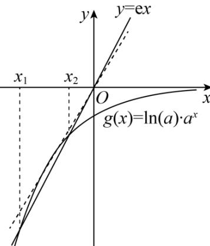

> [!faq]- 《专题16 导数及其应用小题综合》真题解析
>
> > [!success]- **【答案】** 详见解析
>
> > [!note]- **【分析】**
> > 【分析】法一：依题可知，方程 $2\ln a \cdot a^{x} - 2 \mathrm{e}x = 0$ 的两个根为 $x_{1}, x_{2}$ ，即函数 $y = \ln a \cdot a^{x}$ 与函数 $y = \mathrm{e}x$ 的图象有两个不同的交点，构造函数 $g(x) = \ln a \cdot a^{x}$ ，利用指数函数的图象和图象变换得到 $g(x)$ 的图象，利用导数的几何意义求得过原点的切线的斜率，根据几何意义可得出答案：
>
> > [!note]- **【解析】**
> > 【详解】[方法一]：【最优解】转化法，零点的问题转为函数图象的交点因为 $f'(x)=2\ln a\cdot a^{x}-2\mathrm{e}x$ ，所以方程 $2\ln a\cdot a^{x}-2\mathrm{e}x=0$ 的两个根为 $x_{1},x_{2}$ ，
> > 即方程 $\ln a\cdot a^{x}=ex$ 的两个根为 $x_{1},x_{2}$ 即函数 $y = \ln a \cdot a^{x}$ 与函数 $y = e x$ 的图象有两个不同的交点，
> > 因为 $x_{1}, x_{2}$ 分别是函数 $f(x)=2a^{x}-\mathrm{e}x^{2}$ 的极小值点和极大值点，
> > 所以函数 $f(x)$ 在 $(-∞, x_{1})$ 和 $(x_{2}, +∞)$ 上递减，在 $(x_{1}, x_{2})$ 上递增，
> > 所以当时 $(-∞, x_{1})(x_{2}, +∞)$ ， $f'(x)<0$ ，即 y=e x 图象在 $y=\ln a\cdot a^{x}$ 上方
> > 当 $x\in(x_{1},x_{2})$ 时， $f'(x)>0$ ，即 y=e x 图象在 $y=\ln a\cdot a^{x}$ 下方
> > a > 1，图象显然不符合题意，所以 0 < a < 1。
> > 令 $g(x)=\ln a\cdot a^{x}$ ，则 $g'(x)=\ln^{2}a\cdot a^{x},0<a<1$ 设过原点且与函数 $y=g(x)$ 的图象相切的直线的切点为 $(x_{0},\ln a\cdot a^{x_{0}})$ 则切线的斜率为 $g'(x_{0})=\ln^{2}a\cdot a^{x_{0}}$ ，故切线方程为 $y-\ln a\cdot a^{x_{0}}=\ln^{2}a\cdot a^{x_{0}}(x-x_{0})$ 则有 $-\ln a\cdot a^{x_{0}}=-x_{0}\ln^{2}a\cdot a^{x_{0}}$ ，解得 $x_{0}=\frac{1}{\ln a}$ ，则切线的斜率为 $\ln^{2}a\cdot a^{\frac{1}{\ln a}}=\mathrm{e}\ln^{2}a$ 因为函数 $y=\ln a\cdot a^{x}$ 与函数 y=e x 的图象有两个不同的交点，
> > 
> > 所以 $\mathrm{e}\ln^2 a < \mathrm{e}$ ，解得 $\frac{1}{\mathrm{e}} < a < \mathrm{e}$ ，又 $0 < a < 1$ ，所以 $\frac{1}{\mathrm{e}} < a < 1$
> > 综上所述， $a$ 的取值范围为 $\left(\frac{1}{\mathrm{e}},1\right)$
> > [方法二]：【通性通法】构造新函数，二次求导
> > $f'(x)=2\ln a\cdot a^{x}-2ex=0$ 的两个根为 $x_{1}, x_{2}$
> > 因为 $x_{1}, x_{2}$ 分别是函数 $f(x) = 2a^{x} - \mathrm{e}x^{2}$ 的极小值点和极大值点，
> > 所以函数 $f(x)$ 在 $(- \infty, x_{1})$ 和 $(x_{2}, + \infty)$ 上递减，在 $(x_{1}, x_{2})$ 上递增，
> > 设函数 $\mathrm{g}(x) = f'(x) = 2(a^x \ln a - ex)$ ，则 $f'(x) = 2a^x (\ln a)^2 - 2e$ ，
> > 若 $a > 1$ ，则 $f'(x)$ 在R上单调递增，此时若 $f'(x_0) = 0$ ，
> > 则 $f'(x)$ 在 $(- \infty, x_0)$ 上单调递减，在 $(x_0, + \infty)$ 上单调递增，此时若有 $x = x_{1}$ 和 $x = x_{2}$ 分别是函数 $f(x) = 2a^{x} - ex^{2} (a > 0$ 且 $a \neq 1)$ 的极小值点和极大值点，则 $x_{1} > x_{2}$ ，不符合题意；
> > 若 $0 < a < 1$ ，则 ${}^{\prime}(x)$ 在 R 上单调递减，此时若 ${}^{\prime}(x_0) = 0$ ，则 $f^{\prime}(x)$ 在 $(- \infty, x_0)$ 上单调递增，在 $(x_0, +\infty)$ 上单调递减，令 ${}^{\prime}(x_0) = 0$ ，则 $a^{x_0} = \frac{e}{(\ln a)^2}$ ，此时若有 $x = x_1$ 和 $x = x_2$ 分别是函数 $f(x) = 2a^x - ex^2 (a > 0$ 且 $a \neq 1)$ 的极小值点和极大值点，且 $x_1 < x_2$ ，则需满足 $f^{\prime}(x_0) > 0$ ， $f^{\prime}(x_0) = 2(a^{x_0} \ln a - ex_0) = 2\left(\frac{e}{\ln a} - ex_0\right) > 0$ ，即 $x_0 < \frac{1}{\ln a}$ ， $x_0 \ln a > 1$ 故 $\ln a^{x_0} = x_0 \ln a = \ln \frac{e}{(\ln a)^2} > 1$ ，所以 $\frac{1}{e} < a < 1$ 。
> > 【整体点评】法一：利用函数的零点与两函数图象交点的关系，由数形结合解出，突出“小题小做”，是该题的最优解；
> > 法二：通过构造新函数，多次求导判断单调性，根据极值点的大小关系得出不等式，解出即可，该法属于通性通法。
