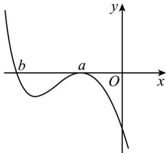
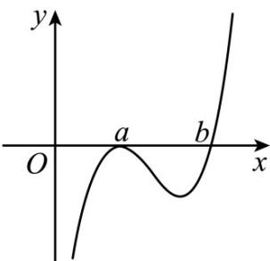

> [!faq]- 《专题16 导数及其应用小题综合》真题解析
>
> > [!success]- **【答案】** D
>
> > [!note]- **【分析】**
> > 【分析】
> >
> > 先考虑函数的零点情况，注意零点左右附近函数值是否变号，结合极大值点的性质，对 $a$ 进行分类讨论，画出 $f(x)$ 图象，即可得到 $a, b$ 所满足的关系，由此确定正确选项·
>
> > [!note]- **【解析】**
> > 【详解】若 $a = b$ ，则 $f(x) = a(x - a)^3$ 为单调函数，无极值点，不符合题意，故 $a^1 \cdot b \cdot$ $\therefore f(x)$ 有 $a$ 和 $b$ 两个不同零点，且在 $x = a$ 左右附近是不变号，在 $x = b$ 左右附近是变号的·依题意， $a$ 为函数 $f(x) = a(x - a)^2 (x - b)$ 的极大值点， $\therefore$ 在 $x = a$ 左右附近都是小于零的。当 $a < 0$ 时，由 $x > b$ ， $f(x) \leq 0$ ，画出 $f(x)$ 的图象如下图所示：
> > 
> > 由图可知 b < a ， a < 0 ，故 $ab > a^{2}$
> > 当 $a > 0$ 时，由 $x > b$ 时， $f(x) > 0$ ，画出 $f(x)$ 的图象如下图所示：
> > 
> > 由图可知 $b>a$ ，a>0，故 $ab>a^{2}$
> > 综上所述， $ab > a^{2}$ 成立·
> > 故选：D
> > 【点睛】本小题主要考查三次函数的图象与性质，利用数形结合的数学思想方法可以快速解答。
