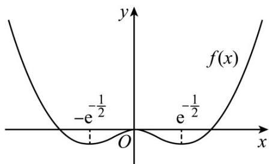

> [!faq]- 《专题16 导数及其应用小题综合》真题解析
>
> > [!success]- **【答案】** ABC
>
> > [!note]- **【分析】**
> > 方法一：利用赋值法，结合函数奇偶性的判断方法可判断选项 ABC，举反例 $f(x)=0$ 即可排除选项 D.
> >
> > 方法二：选项ABC的判断与方法一同，对于D，可构造特殊函数 $f(x) = \left\{ \begin{array}{ll}x^{2}\ln |x|, & x\neq 0\\ 0,x = 0 \end{array} \right.$ 进行判断即可
>
> > [!note]- **【解析】**
> > 方法一：
> > 因为 $f(xy) = y^{2}f(x) + x^{2}f(y)$
> > 对于 A，令 x = y = 0 ， $f(0) = 0f(0) + 0f(0) = 0$ ，故 A 正确。
> > 对于 B，令 x = y = 1 ， $f(1) = 1f(1) + 1f(1)$ ，则 $f(1) = 0$ ，故 B 正确。
> > 对于 C，令 x = y = -1 ， $f(1) = f(-1) + f(-1) = 2f(-1)$ ，则 $f(-1) = 0$
> > 令 $y = -1, f(-x) = f(x) + x^2 f(-1) = f(x)$
> > 又函数 $f(x)$ 的定义域为 $\mathbf{R}$ ，所以 $f(x)$ 为偶函数，故 $\mathrm{C}$ 正确，
> > 对于 D，不妨令 $f(x)=0$ ，显然符合题设条件，此时 $f(x)$ 无极值，故 D 错误。
> > 方法二：
> > 因为 $f(xy)=y^{2}f(x)+x^{2}f(y)$
> > 对于 A，令 x = y = 0 ， $f(0) = 0f(0) + 0f(0) = 0$ ，故 A 正确。
> > 对于 B，令 x = y = 1 ， $f(1) = 1f(1) + 1f(1)$ ，则 $f(1) = 0$ ，故 B 正确。
> > 对于 C，令 x = y = -1 ， $f(1) = f(-1) + f(-1) = 2f(-1)$ ，则 $f(-1) = 0$
> > 令 $y = -1, f(-x) = f(x) + x^{2}f(-1) = f(x)$
> > 又函数 $f(x)$ 的定义域为 $\mathbf{R}$ ，所以 $f(x)$ 为偶函数，故 $\mathrm{C}$ 正确，
> > 对于D，当 $x^{2}y^{2}\neq 0$ 时，对 $f(xy) = y^{2}f(x) + x^{2}f(y)$ 两边同时除以 $x^{2}y^{2}$ ，得到 $\frac{f(xy)}{x^2y^2} = \frac{f(x)}{x^2} +\frac{f(y)}{y^2}$
> > 故可以设 $\frac{f(x)}{x^2} = \ln |x| (x \neq 0)$ ，则 $f(x) = \begin{cases} x^2 \ln |x|, & x \neq 0 \\ 0, & x = 0 \end{cases}$ ，
> > 当 x > 0 时， $f(x) = x^{2} \ln x$ ，则 $f'(x) = 2x \ln x + x^{2} \cdot \frac{1}{x} = x (2 \ln x + 1)$ ，
> > 令 $f'(x) < 0$ ，得 $0 < x < e^{-\frac{1}{2}}$ ；令 $f(\phi(x)) > 0$ ，得 $x > e^{-\frac{1}{2}}$ ；
> > 故 $f(x)$ 在 $\left(0, \mathrm{e}^{-\frac{1}{2}}\right)$ 上单调递减，在 $\left(\mathrm{e}^{-\frac{1}{2}}, +\infty\right)$ 上单调递增，
> > 因为 $f(x)$ 为偶函数，所以 $f(x)$ 在 $\left(-\mathrm{e}^{-\frac{1}{2}},0\right)$ 上单调递增，在 $\left(-\infty ,\mathrm{e}^{-\frac{1}{2}}\right)$ 上单调递减，
> > 
> > 显然，此时 $x = 0$ 是 $f(x)$ 的极大值，故 $\mathbb{D}$ 错误
> >
> > 故选 **ABC**·
