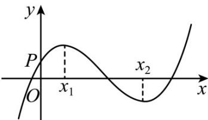

<!-- question-source:start -->
3. (2015·安徽·高考真题) 函数 $f(x) = ax^3 + bx^2 + cx + d$ 的图象如图所示，则下列结论成立的是（）

A. $a > 0$ ， $b <   0$ ， $c > 0$ ， $d > 0$ B. $a > 0$ ， $b <   0$ ， $c <   0$ ， $d > 0$ C. $a <   0$ ， $b <   0$ ， $c > 0$ ， $d > 0$ D. $a > 0$ ， $b > 0$ ， $c > 0$ ， $d <   0$
<!-- question-source:end -->

![[高中/真题/按题型分类/专题16 导数及其应用小题综合/考点09_利用导数研究方程的根及其应用/真题/answers/Q00034981A1.md]]
