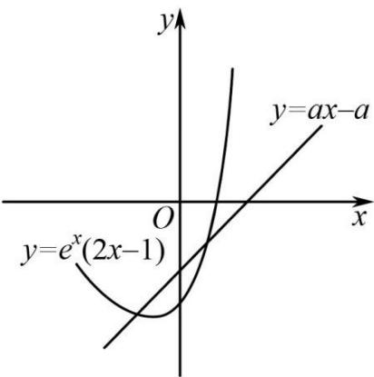

> [!faq]- 《专题16 导数及其应用小题综合》真题解析
>
> > [!success]- **【答案】** D
>
> > [!note]- **【分析】**
> > 设 $g(x)=e^{x}(2x-1)$ ， $y=a(x-1)$ ，问题转化为存在唯一的整数 $x_{0}$ 使得满足 $g(x_{0})<a(x-1)$ ，求导可得出函数 $y=g(x)$ 的极值，数形结合可得 $-a>g(0)=-1$ 且 $g(-1)=-\frac{3}{e}-2a$ ，由此可得出实数 a 的取值范围.
>
> > [!note]- **【解析】**
> > 设 $g(x)=e^{x}(2x-1)$ ， $y=a(x-1)$
> > 由题意知，函数 $y = g(x)$ 在直线 $y = ax - a$ 下方的图象中只有一个点的横坐标为整数，
> > 
> > ，当时，；当时，
> > $$
> > g ^ {\prime} (x) = e ^ {x} (2 x + 1)
> > $$
> > $$
> > x <   - \frac {1}{2}
> > $$
> > $$
> > g ^ {\prime} (x) <   0
> > $$
> > $$
> > x > - \frac {1}{2}
> > $$
> > $$
> > g ^ {\prime} (x) > 0
> > $$
> > 所以，函数 $y = g(x)$ 的最小值为 $g\left(-\frac{1}{2}\right) = -2e^{-\frac{1}{2}}$ .
> > 又 $g(0) = -1$ ， $g(1) = e > 0$ .
> > 直线 y = ax - a 恒过定点 $(1,0)$ 且斜率为 a，
> > 故 $-a > g(0) = -1$ 且 $g(-1) = -\frac{3}{e} - a - a$ ，解得 $\frac{3}{2e} \leq a < 1$ ，故选D.
> > 【点睛】本题考查导数与极值，涉及数形结合思想转化，属于中等题·
