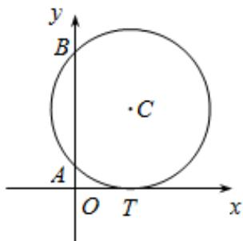

<!-- question-source:start -->
10．（2015·湖北·高考真题）如图，已知圆 C 与 x 轴相切于点 $T(1,0)$ ，与 y 轴正半轴交于两点 A，B（B 在 A 的上方），且 $\left|AB\right|=2$ ．

<!-- question-source:end -->

![[高中/真题/按题型分类/专题17 直线与圆小题综合/考点02_直线与圆的位置关系及其应用/真题/answers/Q00035007A1.md]]
