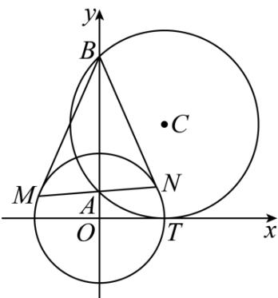

<!-- question-source:start -->
11．（2015·湖北·高考真题）如图，圆 C 与 x 轴相切于点 $T(1,0)$ ，与 y 轴正半轴交于两点 A, B （B 在 A 的上方），且 $\left|AB\right|=2$ ．

(1) 圆 C 的标准方程为 \_\_\_\_ ;

(Ⅱ) 过点 A 任作一条直线与圆 $O: x^{2} + y^{2} = 1$ 相交于 $M, N$ 两点，下列三个结论：

① $\frac{|NA|}{|NB|}=\frac{|MA|}{|MB|}$ ；② $\frac{|NB|}{|NA|}-\frac{|MA|}{|MB|}=2$ ；③ $\frac{|NB|}{|NA|}+\frac{|MA|}{|MB|}=2\sqrt{2}$

其中正确结论的序号是\_\_\_\_。（写出所有正确结论的序号）

<!-- question-source:end -->

![[高中/真题/按题型分类/专题17 直线与圆小题综合/考点02_直线与圆的位置关系及其应用/真题/answers/Q00035008A1.md]]
