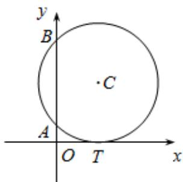

<!-- question-source:start -->
12．（2015·湖北·高考真题）如图，已知圆 C 与 x 轴相切于点 $T(1,0)$ ，与 y 轴正半轴交于两点 A，B（B 在 A 的上方），且 $\left|AB\right|=2$ 。

(1) 圆 C 的标准方程为 \_\_\_\_ ;

(Ⅱ) 圆 C 在点 B 处的切线在 x 轴上的截距为 \_\_\_\_ .
<!-- question-source:end -->

![[高中/真题/按题型分类/专题17 直线与圆小题综合/考点03_圆中的切线问题/真题/answers/Q00035019A1.md]]
