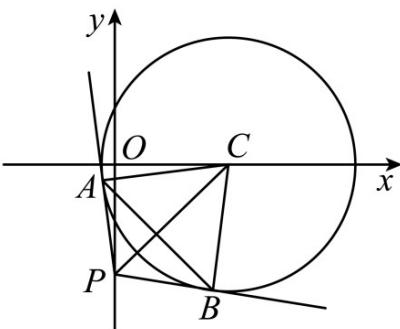

> [!faq]- 《专题17 直线与圆小题综合》真题解析
>
> > [!success]- **【答案】** B
>
> > [!note]- **【分析】**
> > 方法一：根据切线的性质求切线长，结合倍角公式运算求解；方法二：根据切线的性质求切线长结合余弦定理运算求解；方法三：根据切线结合点到直线的距离公式可得 $k^{2}+8k+1=0$ ，利用韦达定理结合夹角公式运算求解。
>
> > [!note]- **【解析】**
> > 方法一：因为 $x^{2} + y^{2} - 4x - 1 = 0$ ，即 $(x - 2)^{2} + y^{2} = 5$ ，可得圆心 $C(2,0)$ ，半径 $r = \sqrt{5}$
> > 过点 $P(0, -2)$ 作圆 $C$ 的切线，切点为 $A, B$
> > 因为 $|PC| = \sqrt{2^2 + (-2)^2} = 2\sqrt{2}$ ，则 $|PA| = \sqrt{|PC|^2 - r^2} = \sqrt{3}$
> > 可得 $\sin \angle APC = \frac{\sqrt{5}}{2\sqrt{2}} = \frac{\sqrt{10}}{4},\cos \angle APC = \frac{\sqrt{3}}{2\sqrt{2}} = \frac{\sqrt{6}}{4}$
> > $$
> > \sin \angle A P B = \sin 2 \angle A P C = 2 \sin \angle A P C \cos \angle A P C = 2 \times \frac {\sqrt {1 0}}{4} \times \frac {\sqrt {6}}{4} = \frac {\sqrt {1 5}}{4}
> > $$
> > $$
> > \cos \angle A P B = \cos 2 \angle A P C = \cos^ {2} \angle A P C - \sin^ {2} \angle A P C = \left(\frac {\sqrt {6}}{4}\right) ^ {2} - \left(\frac {\sqrt {1 0}}{4}\right) ^ {2} = - \frac {1}{4} <   0
> > $$
> > 即 $\angle APB$ 为钝角，
> > 所以 $\sin \alpha = \sin (\pi -\angle APB) = \sin \angle APB = \frac{\sqrt{15}}{4}$
> > 法二：圆 $x^{2} + y^{2} - 4x - 1 = 0$ 的圆心 $C(2,0)$ ，半径 $r = \sqrt{5}$
> > 过点 $P(0, -2)$ 作圆 $C$ 的切线，切点为 $A, B$ ，连接 $AB$ ，
> > 可得 $\left|PC\right|=\sqrt{2^{2}+\left(-2\right)^{2}}=2\sqrt{2}$ ，则 $\left|PA\right|=\left|PB\right|=\sqrt{\left|PC\right|^{2}-r^{2}}=\sqrt{3}$ ，
> > 因为 $\left|PA\right|^2 +\left|PB\right|^2 -2\left|PA\right|\cdot \left|PB\right|\cos \angle APB = \left|CA\right|^2 +\left|CB\right|^2 -2\left|CA\right|\cdot \left|CB\right|\cos \angle ACB$
> > 且 $\angle ACB = \pi -\angle APB$ ，则 $3 + 3 - 6\cos \angle APB = 5 + 5 - 10\cos (\pi -\angle APB)$
> > 即 $3 - \cos \angle APB = 5 + 5\cos \angle APB$ ，解得 $\cos \angle APB = -\frac{1}{4} < 0$
> > 即 $\angle APB$ 为钝角，则 $\cos \alpha = \cos (\pi -\angle APB) = -\cos \angle APB = \frac{1}{4}$
> > 且 $\alpha$ 为锐角，所以 $\sin\alpha=\sqrt{1-\cos^{2}\alpha}=\frac{\sqrt{15}}{4}$ ;
> > 方法三：圆 $x^{2} + y^{2} - 4x - 1 = 0$ 的圆心 $C(2,0)$ ，半径 $r = \sqrt{5}$
> > 若切线斜率不存在，则切线方程为 x=0，则圆心到切点的距离 d=2>r，不合题意；
> > 若切线斜率存在，设切线方程为 $y = kx - 2$ ，即 $kx - y - 2 = 0$ ，
> > 则 $\frac{|2k - 2|}{\sqrt{k^2 + 1}} = \sqrt{5}$ ，整理得 $k^2 + 8k + 1 = 0$ ，且 $\Delta = 64 - 4 = 60 > 0$
> > 设两切线斜率分别为 $k_{1}, k_{2}$ ，则 $k_{1} + k_{2} = -8, k_{1}k_{2} = 1$ ，
> > 可得 $\left|k_{1} - k_{2}\right| = \sqrt{\left(k_{1} + k_{2}\right)^{2} - 4k_{1}k_{2}} = 2\sqrt{15}$
> > 所以 $\tan\alpha=\frac{\left|k_{1}-k_{2}\right|}{1+k_{1}k_{2}}=\sqrt{15}$ ，即 $\frac{\sin\alpha}{\cos\alpha}=\sqrt{15}$ ，可得 $\cos\alpha=\frac{\sin\alpha}{\sqrt{15}}$ ，
> > 则 $\sin^2\alpha +\cos^2\alpha = \sin^2\alpha +\frac{\sin^2\alpha}{15} = 1$
> > 且 $\alpha \in (0,\pi)$ ，则 $\sin \alpha >0$ ，解得 $\sin \alpha = \frac{\sqrt{15}}{4}$
> > 故选：B.
> > 
