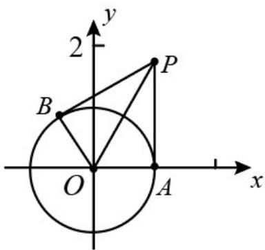

> [!faq]- 《专题17 直线与圆小题综合》真题解析
>
> > [!success]- **【答案】** $\frac{3}{2}$
>
> > [!note]- **【分析】**
> > 本题未单列分析。
>
> > [!note]- **【解析】**
> > 如图，连接 $PO$ ，在直角三角形 $PAO$ 中， $OA = 1, PA = \sqrt{3}$ 所以， $\tan \angle APO = \frac{\sqrt{3}}{3}$
> > $\cos \angle APB = \frac{1 - \tan^2 \angle APO}{1 + \tan^2 \angle APO} = \frac{1 - (\frac{\sqrt{3}}{3})^2}{1 + (\frac{\sqrt{3}}{3})^2} = \frac{1}{2}$ ，故 $PA \cdot PB = |PA| \cdot |PB| \cos \angle APB = \sqrt{3} \times \sqrt{3} \times \frac{1}{2} = \frac{3}{2}$ .
> > 
> > 考点： $^{1}$ ·直线与圆的位置关系； $^{2}$ ·平面向量的数量积·
