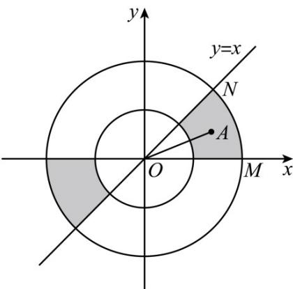

> [!faq]- 《专题17 直线与圆小题综合》真题解析
>
> > [!success]- **【答案】** C
>
> > [!note]- **【分析】**
> > 根据题意分析区域的几何意义，结合几何概型运算求解·
>
> > [!note]- **【解析】**
> > 因为区域 $\left\{(x,y)\mid1\leq x^{2}+y^{2}\leq4\right\}$ 表示以 $O(0,0)$ 圆心，外圆半径 R=2 ，内圆半径 r=1 的圆环，则直线 OA 的倾斜角不大于 $\frac{\pi}{4}$ 的部分如阴影所示，在第一象限部分对应的圆心角 $\angle MON=\frac{\pi}{4}$ ，结合对称性可得所求概率 $P=\frac{3\pi\times\frac{1}{4}}{3\pi}=\frac{1}{4}$ .
> > 故选：C.
> > 
