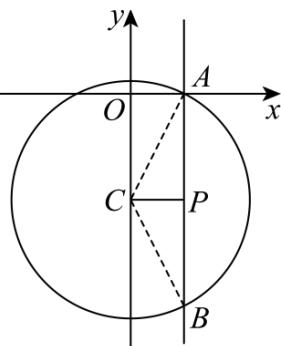

> [!faq]- 《专题17 直线与圆小题综合》真题解析
>
> > [!success]- **【答案】** C
>
> > [!note]- **【分析】**
> > 结合等差数列性质将 $c$ 代换，求出直线恒过的定点，采用数形结合法即可求解【详解】因为 a, b, c 成等差数列，所以 $2b = a + c$ ，c = 2b - a，代入直线方程 $ax + by + c = 0$ 得 $ax + by + 2b - a = 0$ ，即 $a(x - 1) + b(y + 2) = 0$ ，令 $\left\{\begin{aligned}x - 1 &= 0 \\ y + 2 &= 0\end{aligned}\right.$ 得 $\left\{\begin{aligned}x &= 1 \\ y &= -2\end{aligned}\right.$ ，
> >
> > 故直线恒过 $(1, -2)$ ，设 $P(1, -2)$ ，圆化为标准方程得： $C: x^{2} + (y + 2)^{2} = 5$ ，
> >
> > 设圆心为 C，画出直线与圆的图形，由图可知，当 $PC \perp AB$ 时， $|AB|$ 最小， $|PC| = 1, |AC| = |r| = \sqrt{5}$ ，此时 $|AB| = 2|AP| = 2\sqrt{AC^{2} - PC^{2}} = 2\sqrt{5 - 1} = 4$ 。
> >
> > 
> >
> > 故选：C
>
> > [!note]- **【解析】**
> > 本题未单列解析。
