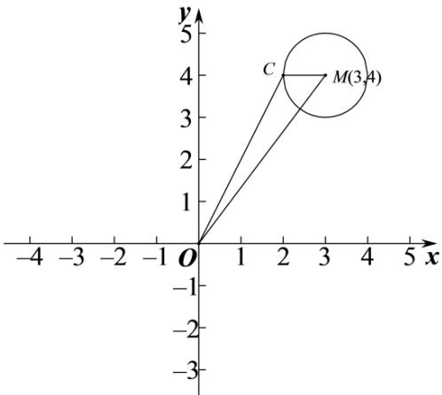

> [!faq]- 《专题17 直线与圆小题综合》真题解析
>
> > [!success]- **【答案】** A
>
> > [!note]- **【分析】**
> > 【分析】求出圆心 C 的轨迹方程后，根据圆心 M 到原点 O 的距离减去半径 1 可得答案：
>
> > [!note]- **【解析】**
> > 【详解】设圆心 $C(x,y)$ ，则 $\sqrt{(x-3)^{2}+(y-4)^{2}}=1$ ，
> > 化简得 $(x - 3)^2 +(y - 4)^2 = 1$
> > 所以圆心 C 的轨迹是以 $M(3,4)$ 为圆心， $^{1}$ 为半径的圆，
> > 
> > 所以 $|OC| + 1$ $|OM| = \sqrt{3^2 + 4^2} = 5$ ，所以 $|OC| = 5 - 1 = 4$
> > 当且仅当 C 在线段 OM 上时取得等号，
> > 故选：A.
> > 【点睛】本题考查了圆的标准方程，属于基础题·
