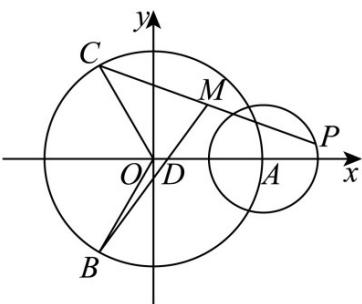

> [!faq]- 《专题17 直线与圆小题综合》真题解析
>
> > [!success]- **【答案】** B
>
> > [!note]- **【分析】**
> > 本题未单列分析。
>
> > [!note]- **【解析】**
> > 【答案】B
> > 【详解】设 $^{D}$ 为三角形 $^{ABC}$ 的外心，如图可得 $\angle ADC = \angle ADB = \angle BDC = 120^{\circ}, \left|DA\right| = \left|DB\right| = \left|DC\right| = 2$ 。以 $D$ 为原点，直线 $DA$ 为 $x$ 轴建立平面直角坐标系，则 $A(2,0), B(-1,-\sqrt{3}), C(-1,\sqrt{3})$ 。设 $P(x,y)$ ，由已知 $\left|AP\right| = 1$ ，得 $(x - 2)^{2} + y^{2} = 1$ ，又 $PM = MC, \therefore M\left(\frac{x - 1}{2}, \frac{y + \sqrt{3}}{2}\right), \therefore BM = \left(\frac{x + 1}{2}, \frac{y + 3\sqrt{3}}{2}\right)$ ，
> > 
> > $\therefore \left|\overrightarrow{BM}\right|^2 = \frac{(x + 1)^2 + (y + 3\sqrt{3})^2}{4}$ ，它表示圆 $(x - 2)^2 + y^2 = 1$ 上的点 $(x,y)$ 与点 $(-1, - 3\sqrt{3})$ 的距离的平方的 $\frac{1}{4}$ ， $\therefore \left(\left|\overrightarrow{BM}\right|^2\right)_{\max} = \frac{1}{4}\left(\sqrt{3^2 + (3\sqrt{3})^2} +1\right)^2 = \frac{49}{4}$ ，故选B.
> > 【名师点睛】本题考查平面向量的夹角与向量的模，由于结论是要求向量模的平方的最大值，因此我们要把它用一个参数表示出来，解题时首先对条件进行化简变形，本题中得出 $\angle ADC = \angle ADB = \angle BDC = 120^{\circ}$ 且 $\left|\overrightarrow{DA}\right| = \left|\overrightarrow{DB}\right| = \left|\overrightarrow{DC}\right| = 2$ ，因此我们采用解析法，即建立直角坐标系，写出点 $A, B, C, D$ 的坐标，同时动点 $P$ 的轨迹是圆，则 $\left|\overrightarrow{BM}\right|^2 = \frac{(x + 1)^2 + (y + 3\sqrt{3})^2}{4}$ ，因此可用圆的性质得出最值．因此本题又考查了数形结合的数学思想．
