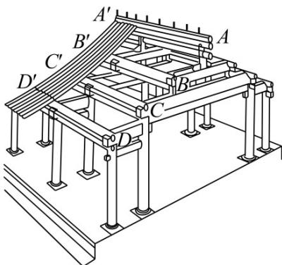
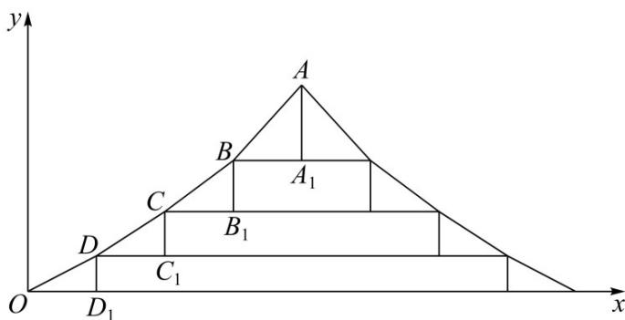

<!-- question-source:start -->
4.（2022·全国新Ⅱ卷·高考真题）图1是中国古代建筑中的举架结构， $AA',BB',CC',DD'$ 是桁，相邻桁的水平距离称为步，垂直距离称为举，图2是某古代建筑屋顶截面的示意图．其中 $DD_{1},CC_{1},BB_{1},AA_{1}$ 是举， $OD_{1},DC_{1},CB_{1},BA_{1}$ 是相等的步，相邻桁的举步之比分别为 $\frac{DD_{1}}{OD_{1}}=0.5,\frac{CC_{1}}{DC_{1}}=k_{1},\frac{BB_{1}}{CB_{1}}=k_{2},\frac{AA_{1}}{BA_{1}}=k_{3}$ ．已知 $k_{1},k_{2},k_{3}$ 成公差为0.1的等差数列，且直线OA的斜率为0.725，则 $k_{3}=(\quad)$

图1

图2

A 0.75 B 0.8 C 0.85 D 0.9
<!-- question-source:end -->

![[高中/真题/按题型分类/专题17 直线与圆小题综合/考点_04_直线_圆与其他知识点综合/真题/answers/Q00035023A1.md]]
