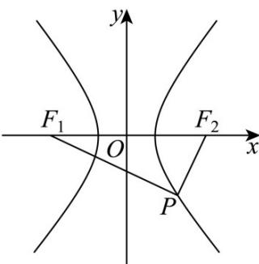

> [!faq]- 《专题18 圆锥曲线》真题解析
>
> > [!success]- **【答案】** C
>
> > [!note]- **【分析】**
> > 可利用 $^{\triangle}PF_{1}F_{2}$ 三边斜率问题与正弦定理，转化出三边比例，设 $\left|PF_{2}\right|=m$ ，由面积公式求出m，
> > 由勾股定理得出c，结合第一定义再求出a·
>
> > [!note]- **【解析】**
> > 如下图：由题可知，点 $P$ 必落在第四象限， $\angle F_{1}PF_{2} = 90^{\circ}$ ，设 $\left|PF_2\right| = m$
> > $\angle PF_{2}F_{1} = \theta_{1},\angle PF_{1}F_{2} = \theta_{2}$ ，由 $k_{PF_2} = \tan \theta_1 = 2$ ，求得 $\sin \theta_1 = \frac{2}{\sqrt{5}}$
> > 
> > 因为 $\angle F_{1}PF_{2} = 90^{\circ}$ ，所以 $k_{PF_1}\cdot k_{PF_2} = -1$ ，求得 $k_{PF_1} = -\frac{1}{2}$ ，即 $\tan \theta_{2} = \frac{1}{2}$
> > $\sin \theta_{2} = \frac{1}{\sqrt{5}}$ ，由正弦定理可得： $\left|PF_1\right|\colon \left|PF_2\right|\colon \left|F_1F_2\right| = \sin \theta_1:\sin \theta_2:\sin 90^\circ = 2:1:\sqrt{5}$
> > 则由 $\left|PF_2\right| = m$ 得 $\left|PF_1\right| = 2m,\left|F_1F_2\right| = 2c = \sqrt{5} m$
> > 由 $S_{\triangle PF_1F_2} = \frac{1}{2}\left|PF_1\right|\cdot \left|PF_2\right| = \frac{1}{2} m\cdot 2m = 8$ 得 $m = 2\sqrt{2}$
> > 则 $\left|PF_2\right| = 2\sqrt{2},\left|PF_1\right| = 4\sqrt{2},\left|F_1F_2\right| = 2c = 2\sqrt{10},c = \sqrt{10}$
> > 由双曲线第一定义可得： $\left|PF_1\right| - \left|PF_2\right| = 2a = 2\sqrt{2}$ ， $a = \sqrt{2}, b = \sqrt{c^2 - a^2} = \sqrt{8}$
> > 所以双曲线的方程为 $\frac{x^{2}}{2}-\frac{y^{2}}{8}=1$ .
> >
> > 故选 **C**
