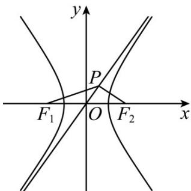

> [!faq]- 《专题18 圆锥曲线》真题解析
>
> > [!success]- **【答案】** D
>
> > [!note]- **【分析】**
> > 先由点到直线的距离公式求出 $b$ ，设 $\angle POF_{2} = \theta$ ，由 $\tan \theta = \frac{b}{|OP|} = \frac{b}{a}$ 得到 $|OP| = a$ ， $|OF_{2}| = c$ ·再由三角形的面积公式得到 $y_{P}$ ，从而得到 $x_{P}$ ，则可得到 $\frac{a}{a^{2} + 2} = \frac{\sqrt{2}}{4}$ ，解出 $a$ ，代入双曲线的方程即可得到答案·
>
> > [!note]- **【解析】**
> > 如图，
> > 
> > 因为 $F_{2}(c,0)$ ，不妨设渐近线方程为 $y = \frac{b}{a} x$ ，即 $bx - ay = 0$ ，
> > 所以 $\left|PF_2\right| = \frac{\left|bc\right|}{\sqrt{a^2 + b^2}} = \frac{bc}{c} = b$
> > 所以 b = 2 .
> > 设 $\angle POF_{2} = \theta$ 则 $\tan \theta = \frac{|PF_2|}{|OP|} = \frac{b}{|OP|} = \frac{b}{a}$ ，所以 $|OP| = a$ ，所以 $|OF_2| = c$ .
> > 因为 $\frac{1}{2} ab = \frac{1}{2} c \cdot y_P$ ，所以 $y_P = \frac{ab}{c}$ ，所以 $\tan \theta = \frac{y_P}{x_P} = \frac{\frac{ab}{c}}{x_P} = \frac{b}{a}$ ，所以 $x_P = \frac{a^2}{c}$ ，所以 $P\left(\frac{a^2}{c}, \frac{ab}{c}\right)$ ，
> > 因为 $F_1(-c,0)$ ，
> > 所以 $k_{PF_1} = \frac{\frac{ab}{c}}{\frac{a^2}{c} + c} = \frac{ab}{a^2 + c^2} = \frac{2a}{a^2 + a^2 + 4} = \frac{a}{a^2 + 2} = \frac{\sqrt{2}}{4}$ ，
> > 所以 $\sqrt{2}(a^2 + 2) = 4a$ ，解得 $a = \sqrt{2}$ ，
> > 所以双曲线的方程为 $\frac{x^2}{2} - \frac{y^2}{4} = 1$
> >
> > 故选 **D**
