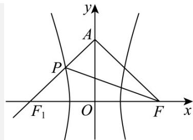

> [!faq]- 《专题18 圆锥曲线》真题解析
>
> > [!success]- **【答案】** $12 \sqrt{6}$
>
> > [!note]- **【分析】**
> > 根据题意，根据 $P, A, F_{1}$ 三点共线，求出直线 $AF_{1}$ 的方程，联立双曲线方程，即可求得 $P$ 点坐标，则由 $S_{\Delta APF} = S_{\Delta AFF_{1}} - S_{\Delta PFF_{1}}$ 即可容易求得·
>
> > [!note]- **【解析】**
> > 设双曲线的左焦点为 $F_{1}$ ，由双曲线定义知， $\left|PF\right| = 2a + \left|PF_1\right|$
> > $\therefore \triangle APF$ 的周长为 $|PA| + |PF| + |AF| = |PA| + 2a + \left|PF_1\right| + |AF| = |PA| + \left|PF_1\right| + |AF| + 2a$
> > 由于 $2a + |AF|$ 是定值，要使 $\triangle APF$ 的周长最小，则 $|PA| + |PF_1|$ 最小，即 $P$ 、 $A$ 、 $F_{1}$ 共线，
> > 
> > $\because A(0,6\sqrt{6})$ ， $F_{1}(-3,0)$ ：直线 $AF_{1}$ 的方程为 $\frac{x}{-3} +\frac{y}{6\sqrt{6}} = 1$ ，即 $x = \frac{y}{2\sqrt{6}} -3$ 代入 $x^{2} - \frac{y^{2}}{8} = 1$ 整理得 $y^{2} + 6\sqrt{6} y - 96 = 0$
> > 解得 $y = 2\sqrt{6}$ 或 $y = -8\sqrt{6}$ （舍），所以 $P$ 点的纵坐标为 $2\sqrt{6}$
> > $$
> > \therefore S _ {\Delta A P F} = S _ {\Delta A F F _ {1}} - S _ {\Delta P F F _ {1}} \frac {1}{2} \times 6 \times 6 \sqrt {6} - \frac {1}{2} \times 6 \times 2 \sqrt {6} = 1 2 \sqrt {6}.
> > $$
> > 故答案为： $12\sqrt{6}$
> > 【点睛】本题考查双曲线中三角形面积的求解，涉及双曲线的定义，属综合中档题·
