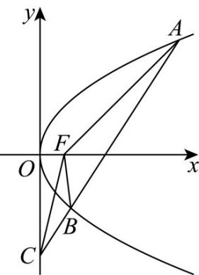

<!-- question-source:start -->
10．（2015·浙江·高考真题）如图，设抛物线 $y^{2}=4x$ 的焦点为 F，不经过焦点的直线上有三个不同的点 A，B，C，其中点 A，B 在抛物线上，点 C 在 y 轴上，则 $\Delta BCF$ 与 $\Delta ACF$ 的面积之比是

A. $\frac{|BF| - 1}{|AF| - 1}$ B. $\frac{|BF|^2 - 1}{|AF|^2 - 1}$ C. $\frac{|BF| + 1}{|AF| + 1}$ D. $\frac{|BF|^2 + 1}{|AF|^2 + 1}$
<!-- question-source:end -->

![[高中/真题/按题型分类/专题18 圆锥曲线/考点03_抛物线方程及其性质/真题/answers/Q00035167A1.md]]
