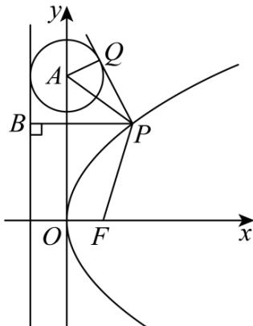

> [!faq]- 《专题18 圆锥曲线》真题解析
>
> > [!success]- **【答案】** ABD
>
> > [!note]- **【分析】**
> > A 选项，抛物线准线为 x=-1 ，根据圆心到准线的距离来判断；B 选项，P,A,B 三点共线时，先求出 P 的坐标，进而得出切线长；C 选项，根据 $\left|PB\right|=2$ 先算出 P 的坐标，然后验证 $k_{PA}k_{AB}=-1$ 是否成立；D 选项，根据抛物线的定义， $\left|PB\right|=\left|PF\right|$ ，于是问题转化成 $\left|PA\right|=\left|PF\right|$ 的 P 点的存在性问题，此时考察 AF 的中垂线和抛物线的交点个数即可，亦可直接设 P 点坐标进行求解。
>
> > [!note]- **【解析】**
> > A选项，抛物线 $y^{2}=4x$ 的准线为x=-1，
> > $\odot A$ 的圆心 $(0,4)$ 到直线 x=-1 的距离显然是 1，等于圆的半径，
> > 故准线 l 和 $\odot A$ 相切，A 选项正确；
> > B 选项，P, A, B 三点共线时，即 $PA \perp l$ ，则 P 的纵坐标 $y_{P} = 4$
> > 由 $y_{P}^{2}=4x_{P}$ ，得到 $x_{P}=4$ ，故 $P(4,4)$ ，
> > 此时切线长 $\left|PQ\right|=\sqrt{\left|PA\right|^{2}-r^{2}}=\sqrt{4^{2}-1^{2}}=\sqrt{15}$ ，B选项正确；
> > C 选项，当 $\left|PB\right|=2$ 时， $x_{P}=1$ ，此时 $y_{P}^{2}=4x_{P}=4$ ，故 $P(1,2)$ 或 $P(1,-2)$ ，
> > 当 $P(1,2)$ 时， $A(0,4), B(-1,2)$ ， $k_{PA} = \frac{4 - 2}{0 - 1} = -2$ ， $k_{AB} = \frac{4 - 2}{0 - (-1)} = 2$ ，
> > 不满足 $k_{PA}k_{AB} = -1$ ;
> > 当 $P(1,-2)$ 时， $A(0,4), B(-1,2)$ ， $k_{PA}=\frac{4-(-2)}{0-1}=-6$ ， $k_{AB}=\frac{4-(-2)}{0-(-1)}=6$ ，
> > 不满足 $k_{PA}k_{AB} = -1$ ;
> > 于是 $PA \perp AB$ 不成立， $^{C}$ 选项错误；
> > D 选项，方法一：利用抛物线定义转化
> > 根据抛物线的定义， $\left|PB\right|=\left|PF\right|$ ，这里 $F(1,0)$ ，
> > 于是 $\left|PA\right|=\left|PB\right|$ 时 P 点的存在性问题转化成 $\left|PA\right|=\left|PF\right|$ 时 P 点的存在性问题，
> > $A(0,4),F(1,0)$ ， $AF$ 中点 $\left(\frac{1}{2},2\right)$ ， $AF$ 中垂线的斜率为 $-\frac{1}{k_{AF}} = \frac{1}{4}$
> > 于是 $_{AF}$ 的中垂线方程为： $y = \frac{2x + 15}{8}$ ，与抛物线 $y^2 = 4x$ 联立可得 $y^2 - 16y + 30 = 0$ ，$\Delta = 16^{2} - 4 \times 30 = 136 > 0$ ，即 $AF$ 的中垂线和抛物线有两个交点，即存在两个 $P$ 点，使得 $|PA| = |PF|$ ，D 选项正确。方法二：（设点直接求解）设 $P\left(\frac{t^2}{4}, t\right)$ ，由 $PB \perp l$ 可得 $B(-1, t)$ ，又 $A(0, 4)$ ，又 $|PA| = |PB|$ ，根据两点间的距离公式， $\sqrt{\frac{t^4}{16} + (t - 4)^2} = \frac{t^2}{4} + 1$ ，整理得 $t^2 - 16t + 30 = 0$ ， $\Delta = 16^2 - 4 \times 30 = 136 > 0$ ，则关于 $t$ 的方程有两个解，即存在两个这样的 $P$ 点，D 选项正确。
> > 故选：ABD
> > 
