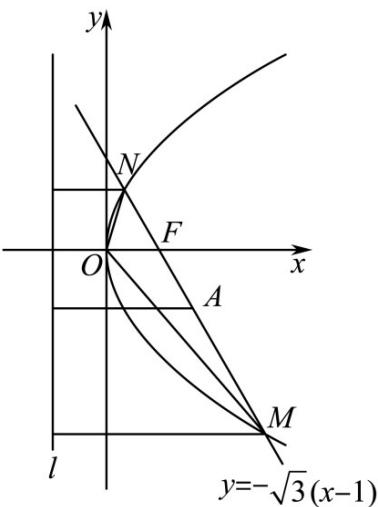

> [!faq]- 《专题18 圆锥曲线》真题解析
>
> > [!success]- **【答案】** AC
>
> > [!note]- **【分析】**
> > 【分析】先求得焦点坐标，从而求得 $p$ ，根据弦长公式求得 $\left|MN\right|$ ，根据圆与等腰三角形的知识确定正确答案· 【详解】A选项：直线 $y = -\sqrt{3}(x - 1)$ 过点 $(1,0)$ ，所以抛物线 $C:y^{2} = 2px(p > 0)$ 的焦点 $F(1,0)$ ，所以 $\frac{p}{2} = 1,p = 2,2p = 4$ ，则A选项正确，且抛物线 $C$ 的方程为 $y^{2} = 4x$
> >
> > B 选项：设 $M(x_{1},y_{1}), N(x_{2},y_{2})$
> >
> > 由 $\left\{\begin{aligned}y&=-\sqrt{3}(x-1)\\ y^{2}&=4x\end{aligned}\right.$ 消去 y 并化简得 $3x^{2}-10x+3=(x-3)(3x-1)=0$
> >
> > 解得 $x_{1}=3, x_{2}=\frac{1}{3}$ ，所以 $\left|MN\right|=x_{1}+x_{2}+p=3+\frac{1}{3}+2=\frac{16}{3}$ ，B 选项错误.
> >
> > C 选项：设 MN 的中点为 A，M, N, A 到直线 l 的距离分别为 $d_{1}, d_{2}, d$
> >
> > 因为 $d=\frac{1}{2}\left(d_{1}+d_{2}\right)=\frac{1}{2}\left(\left|MF\right|+\left|NF\right|\right)=\frac{1}{2}\left|MN\right|$
> >
> > 即 A 到直线 l 的距离等于 MN 的一半，所以以 MN 为直径的圆与直线 l 相切， $^{C}$ 选项正确.
> >
> > D 选项：直线 $y = -\sqrt{3}(x - 1)$ ，即 $\sqrt{3} x + y - \sqrt{3} = 0$
> >
> > $O^{\text{到直线}}\sqrt{3} x + y - \sqrt{3} = 0$ 的距离为 $d = \frac{\sqrt{3}}{2}$
> >
> > 所以三角形 OMN 的面积为 $\frac{1}{2} \times \frac{16}{3} \times \frac{\sqrt{3}}{2} = \frac{4\sqrt{3}}{3}$ ,
> >
> > 由上述分析可知 $y_{1} = -\sqrt{3}(3 - 1) = -2\sqrt{3}, y_{2} = -\sqrt{3}\left(\frac{1}{3} - 1\right) = \frac{2\sqrt{3}}{3}$ ，
> >
> > 所以 $\left|OM\right|=\sqrt{3^{2}+\left(-2\sqrt{3}\right)^{2}}=\sqrt{21},\left|ON\right|=\sqrt{\left(\frac{1}{3}\right)^{2}+\left(\frac{2\sqrt{3}}{3}\right)^{2}}=\frac{\sqrt{13}}{3}$
> >
> > 所以三角形 OMN 不是等腰三角形， $^{D}$ 选项错误
> >
> > 故选：AC.
> >
> > 
>
> > [!note]- **【解析】**
> > 本题未单列解析。
