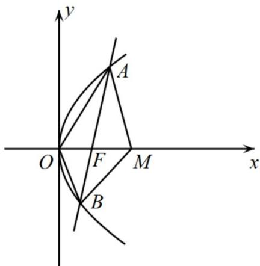

> [!faq]- 《专题18 圆锥曲线》真题解析
>
> > [!success]- **【答案】** ACD
>
> > [!note]- **【分析】**
> > 【分析】由 $\left|AF\right|=\left|AM\right|$ 及抛物线方程求得 $A(\frac{3p}{4},\frac{\sqrt{6}p}{2})$ ，再由斜率公式即可判断A选项；表示出直线AB的方程，联立抛物线求得 $B(\frac{p}{3},-\frac{\sqrt{6}p}{3})$ ，即可求出 $|OB|$ 判断B选项；由抛物线的定义求出 $|AB|=\frac{25p}{12}$ 即可判断C选项；由 $OA\cdot OB<0$ ， $MA\cdot MB<0$ 求得 $\angle AOB$ ， $\angle AMB$ 为钝角即可判断D选项。
>
> > [!note]- **【解析】**
> > 【详解】对于A，易得 $F(\frac{p}{2},0)$ ，由 $|AF|=|AM|$ 可得点A在FM的垂直平分线上，则A点横坐标为 $\frac{p}{2}+p=\frac{3p}{4}$ ，
> > 代入抛物线可得 $y^{2}=2p\cdot\frac{3p}{4}=\frac{3}{2}p^{2}$ ，则 $A(\frac{3p}{4},\frac{\sqrt{6}p}{2})$ ，则直线的斜率为 $\frac{\frac{\sqrt{6}p}{2}}{\frac{3p}{4}-\frac{p}{2}}=2\sqrt{6}$ ，A正确；
> > 对于B，由斜率为 $2\sqrt{6}$ 可得直线AB的方程为 $x=\frac{1}{2\sqrt{6}}y+\frac{p}{2}$ ，联立抛物线方程得 $y^{2}-\frac{1}{\sqrt{6}}py-p^{2}=0$ ，
> > 设 $B(x_{1},y_{1})$ ，则 $\frac{\sqrt{6}}{2}p+y_{1}=\frac{\sqrt{6}}{6}p$ ，则 $y_{1}=-\frac{\sqrt{6}p}{3}$ ，代入抛物线得 $\left(-\frac{\sqrt{6}p}{3}\right)^{2}=2p\cdot x_{1}$ ，解得 $x_{1}=\frac{p}{3}$ ，则 $B(\frac{p}{3},-\frac{\sqrt{6}p}{3})$ ，
> > 则 $\left|OB\right|=\sqrt{\left(\frac{p}{3}\right)^{2}+\left(-\frac{\sqrt{6}p}{3}\right)^{2}}=\frac{\sqrt{7}p}{3}\neq\left|OF\right|=\frac{p}{2}$ ，B错误；
> > 对于 C，由抛物线定义知： $\left|AB\right|=\frac{3p}{4}+\frac{p}{3}+p=\frac{25p}{12}>2p=4\left|OF\right|$ ，C 正确；
> > 对于 D， $\overrightarrow{OA}\cdot\overrightarrow{OB}=(\frac{3p}{4},\frac{\sqrt{6}p}{2})\cdot(\frac{p}{3},-\frac{\sqrt{6}p}{3})=\frac{3p}{4}\cdot\frac{p}{3}+\frac{\sqrt{6}p}{2}\cdot\left(-\frac{\sqrt{6}p}{3}\right)=-\frac{3p^{2}}{4}<0$ ，则 $\angle AOB$ 为钝角，又 $\overrightarrow{MA} \cdot \overrightarrow{MB} = (-\frac{p}{4}, \frac{\sqrt{6}p}{2}) \cdot (-\frac{2p}{3}, -\frac{\sqrt{6}p}{3}) = -\frac{p}{4} \cdot \left(-\frac{2p}{3}\right) + \frac{\sqrt{6}p}{2} \cdot \left(-\frac{\sqrt{6}p}{3}\right) = -\frac{5p^{2}}{6} < 0$ ，则 $\angle AMB$ 为钝角，
> > 又 $\angle AOB + \angle AMB + \angle OAM + \angle OBM = 360^{\circ}$ ，则 $\angle OAM + \angle OBM < 180^{\circ}$ ，D 正确。
> > 故选：ACD.
> > 
