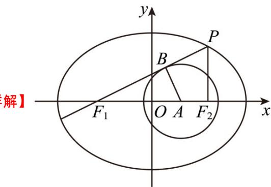

> [!faq]- 《专题18 圆锥曲线》真题解析
>
> > [!success]- **【答案】** $\frac{2\sqrt{5}}{5}$ $\frac{\sqrt{5}}{5}$
>
> > [!note]- **【分析】**
> > 不妨假设 $c = 2$ ，根据图形可知， $\sin \angle PF_1F_2 = \frac{2}{3}$ ，再根据同角三角函数基本关系即可求出 $k = \tan \angle PF_1F_2 = \frac{2}{5}\sqrt{5}$ ；再根据椭圆的定义求出 $a$ ，即可求得离心率.
>
> > [!note]- **【解析】**
> > 
> > 如图所示：不妨假设 c = 2 ，设切点为 B ，
> > $\sin \angle PF_{1}F_{2} = \sin \angle BF_{1}A = \frac{|AB|}{|F_{1}A|} = \frac{2}{3},\tan \angle PF_{1}F_{2} = \frac{2}{\sqrt{3^{2} - 2^{2}}} = \frac{2}{5}\sqrt{5}$
> > 所以 $k = \frac{2\sqrt{5}}{5}$ ，由 $k = \frac{|PF_2|}{|F_1F_2|}, |F_1F_2| = 2c = 4$ ，所以 $|PF_2| = \frac{8\sqrt{5}}{5}$ ， $|PF_1| = |PF_2| \times \frac{1}{\sin\angle PF_1F_2} = \frac{12\sqrt{5}}{5}$ ，于是 $2a = |PF_1| + |PF_2| = 4\sqrt{5}$ ，即 $a = 2\sqrt{5}$ ，所以 $e = \frac{c}{a} = \frac{2}{2\sqrt{5}} = \frac{\sqrt{5}}{5}$ 。
> > 故答案为： $\frac{2\sqrt{5}}{5}$ ； $\frac{\sqrt{5}}{5}$
