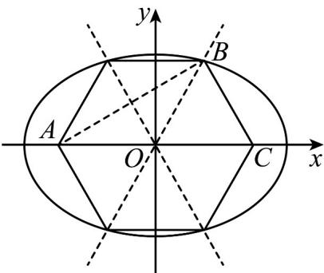

> [!faq]- 《专题18 圆锥曲线》真题解析
>
> > [!success]- **【答案】** 详见解析
>
> > [!note]- **【分析】**
> > 方法一：由正六边形性质得渐近线的倾斜角，解得双曲线中 $m^{2}, n^{2}$ 关系，即得双曲线N的离心率；由正六边形性质得椭圆上一点到两焦点距离之和为 $c + \sqrt{3}c$ ，再根据椭圆定义得 $c + \sqrt{3}c = 2a$ ，解得椭圆M的离心率.
>
> > [!note]- **【解析】**
> > [方法一]：【最优解】数形结合+定义法
> > 由正六边形性质得椭圆上一点到两焦点距离之和为 $c + \sqrt{3} c$ ，再根据椭圆定义得 $c + \sqrt{3} c = 2a$ ，所以椭圆 $M$ 的离心率为 $\frac{c}{a} = \frac{2}{1 + \sqrt{3}} = \sqrt{3} - 1.$
> > 双曲线 N 的渐近线方程为 $y = \pm \frac{n}{m} x$ ，由题意得双曲线 N 的一条渐近线的倾斜角为 $\frac{\pi}{3}$ ， $\therefore \frac{n^{2}}{m^{2}} = \tan^{2} \frac{\pi}{3} = 3$ ， $\therefore e^{2}=\frac{m^{2}+n^{2}}{m^{2}}=\frac{m^{2}+3m^{2}}{m^{2}}=4,\therefore e=2.$
> > 
> > 故答案为： $\sqrt{3} -1$ ；2.
> > [方法二]：数形结合+齐次式求离心率
> > 设双曲线 $\frac{x^{2}}{m^{2}} - \frac{y^{2}}{n^{2}} = 1$ 的一条渐近线 $y = \frac{n}{m} x$ 与椭圆 $\frac{x^{2}}{a^{2}} + \frac{y^{2}}{b^{2}} = 1$ 在第一象限的交点为 $A(x_{0}, y_{0})$ ，椭圆的右焦点为 $F_{2}(c, 0)$ 。由题可知， $A, F_{2}$ 为正六边形相邻的两个顶点，所以 $\angle AOF_{2} = 60^{\circ}$ （O 为坐标原点）。
> > 所以 $\tan 60^{\circ} = \frac{n}{m} = \sqrt{3}$ 。因此双曲线的离心率 $e = \frac{\sqrt{m^2 + n^2}}{m} = \frac{\sqrt{m^2 + 3m^2}}{m} = 2$ 。
> > 由 $y = \frac{n}{m} x$ 与 $\frac{x^2}{a^2} +\frac{y^2}{b^2} = 1$ 联立解得 $A\left(\frac{abm}{\sqrt{m^2b^2 + a^2n^2}},\frac{abn}{\sqrt{m^2b^2 + a^2n^2}}\right)$
> > 因为 $\triangle AOF_{2}$ 是正三角形，所以 $|OA| = c$ ，因此，可得 $\sqrt{\frac{a^2b^2m^2}{m^2b^2 + a^2n^2} + \frac{a^2b^2n^2}{m^2b^2 + a^2n^2}} = c$
> > 将 $n = \sqrt{3} m, b^2 = a^2 - c^2$ 代入上式，化简、整理得 $4a^4 - 8a^2c^2 + c^4 = 0$ ，即 $e^4 - 8e^2 + 4 = 0$ ，解得 $e = \sqrt{3} - 1$ ， $e = \sqrt{3} + 1$ （舍去）.
> > 所以，椭圆的离心率为 $\sqrt{3} - 1$ ，双曲线的离心率为 $2$
> > 故答案为： $\sqrt{3} -1$ ；2.
> > [方法三]：数形结合+椭圆定义+解焦点三角形
> > 由条件知双曲线 N 在第一、三象限的渐近线方程为 $y = \sqrt{3}x$ ，于是双曲线 N 的离心率为 $\sqrt{1 + (\sqrt{3})^2} = 2$ 。设双曲线 $\frac{x^2}{m^2} - \frac{y^2}{n^2} = 1$ 的一条渐近线与椭圆 $\frac{x^2}{a^2} + \frac{y^2}{b^2} = 1$ 在第一象限的交点为 A，椭圆的左、右焦点分别为 $F_1, F_2$ 。在 $\triangle AF_1F_2$ 中， $\angle AF_1F_2 = \frac{\pi}{6}, \angle AF_2F_1 = \frac{\pi}{3}, \angle F_1AF_2 = \frac{\pi}{2}$ 。
> > 由正弦定理得 $\frac{\left|AF_1\right|}{\sin\angle AF_2F_1} = \frac{\left|AF_2\right|}{\sin\angle AF_1F_2} = \frac{\left|F_1F_2\right|}{\sin\angle F_1AF_2}$
> > 于是 $\frac{\left|AF_1\right| + \left|AF_2\right|}{\sin\angle AF_2F_1 + \sin\angle AF_1F_2} = \frac{\left|F_1F_2\right|}{\sin\angle F_1AF_2}$
> > 即椭圆的离心率 $e = \frac{2c}{2a} = \frac{\sin\frac{\pi}{2}}{\sin\frac{\pi}{6} + \sin\frac{\pi}{3}} = \sqrt{3} -1$
> > 故答案为： $\sqrt{3}-1$ ；2。
> > 【整体点评】方法一：直接根据椭圆的定义以及正六边形性质求解，是该题的最优解；
> > 方法二：利用正六边形性质求出双曲线的离心率，根据平面几何条件创建齐次式求出椭圆的离心率，运算较为复杂；
> > 方法三：利用正六边形性质求出双曲线的离心率，再根据通过解焦点三角形求椭圆离心率.
