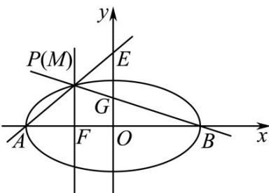

> [!faq]- 《专题18 圆锥曲线》真题解析
>
> > [!success]- **【答案】** A
>
> > [!note]- **【分析】**
> > 本题未单列分析。
>
> > [!note]- **【解析】**
> > 【答案】A
> > 【详解】试题分析：如图取 $P$ 与 $M$ 重合，则由 $A(-a,0), M(-c, \frac{b^2}{a}) \Rightarrow$ 直线 $AM: y = \frac{\overline{b^2}}{-c + a} (x + a) \Rightarrow E(0, \frac{b^2}{a - c})$ 同理由 $B(a,0), M(-c, \frac{b^2}{a}) \Rightarrow G(0, \frac{b^2}{a + c}) \Rightarrow \frac{b^2}{a - c} = \frac{2b^2}{a + c} \Rightarrow a = 3c \Rightarrow e = \frac{1}{3}$ 故选 A.
> > 
> > 考点： $^{1}$ 、椭圆及其性质； $^{2}$ 、直线与椭圆·
> > 【方法点睛】本题考查椭圆及其性质、直线与椭圆，涉及特殊与一般思想、数形结合思想和转化归思想考查逻辑思维能力、等价转化能力、运算求解能力，综合性较强，属于较难题型·
