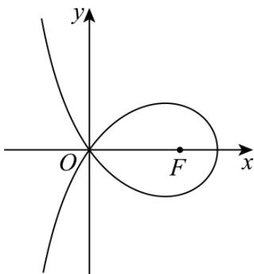

<!-- question-source:start -->
1. （2024·全国新I卷·高考真题）（多选）设计一条美丽的丝带，其造型可以看作图中的曲线 C 的一部分已知 C 过坐标原点 O·且 C 上的点满足：横坐标大于 -2，到点 $F(2,0)$ 的距离与到定直线 $x = a (a < 0)$ 的距离之积为 4，则（）

A. $a = -2$ B.点 $(2\sqrt{2},0)$ 在 $C$ 上

C. $C$ 在第一象限的点的纵坐标的最大值为1 D.当点 $(x_0,y_0)$ 在 $C$ 上时， $y_{0}\leq \frac{4}{x_{0} + 2}$
<!-- question-source:end -->

![[高中/真题/按题型分类/专题18 圆锥曲线/考点05_双曲线的离心率及其应用/对点训练/answers/Q00055201A1.md]]
