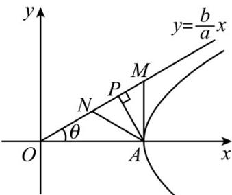

<!-- question-source:start -->
36. (2017·全国·高考真题) 已知双曲线 $C: \frac{x^2}{a^2} - \frac{y^2}{b^2} = 1 (a > 0, b > 0)$ 的右顶点为 $\mathrm{A}$ , 以 $\mathrm{A}$ 为圆心, $b$ 为半径作圆 $\mathrm{A}$ , 圆 $\mathrm{A}$ 与双曲线 $C$ 的一条渐近线于交 $M$ 、 $N$ 两点, 若 $\angle MAN = 60^\circ$ , 则 $C$ 的离心率为 \_\_\_\_. 【答案】 $\frac{2\sqrt{3}}{3}$

<!-- question-source:end -->

![[高中/真题/按题型分类/专题18 圆锥曲线/考点05_双曲线的离心率及其应用/真题/answers/Q00035235A1.md]]
