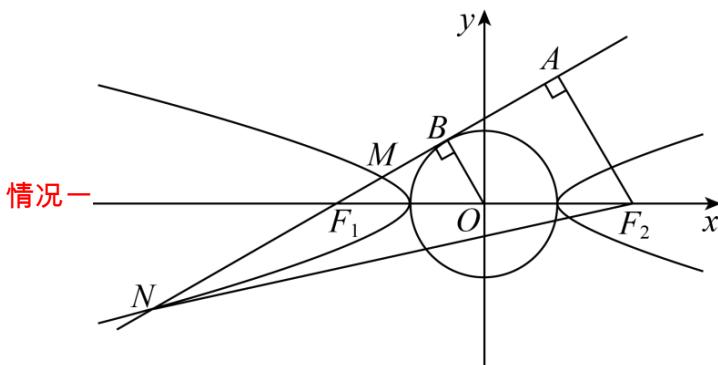
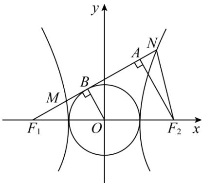
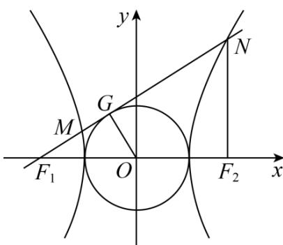
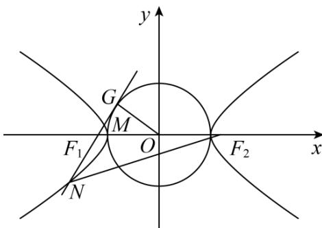

> [!faq]- 《专题18 圆锥曲线》真题解析
>
> > [!success]- **【答案】** AC
>
> > [!note]- **【分析】**
> > 依题意不妨设双曲线焦点在 x 轴，设过 $F_{1}$ 作圆 D 的切线切点为 G，利用正弦定理结合三角变换、双曲线的定义得到 2b = 3a 或 a = 2b，即可得解，注意就 M, N 在双支上还是在单支上分类讨论。
>
> > [!note]- **【解析】**
> > [方法一]：几何法，双曲线定义的应用
> > 
> > M、N 在双曲线的同一支，依题意不妨设双曲线焦点在 x 轴，设过 $F_{1}$ 作圆 D 的切线切点为 B，
> > 所以 OB⊥F₁N ，因为 $\cos\angle F_{1}NF_{2}=\frac{3}{5}>0$ ，所以 N 在双曲线的左支， $|OB|=a,\left|OF_{1}\right|=c,\left|F_{1}B\right|=b$ ，设 $\angle F_{1}NF_{2}=\alpha$ ，由即 $\cos\alpha=\frac{3}{5}$ ，则 $\sin\alpha=\frac{4}{5}$
> > $$
> > \left| \mathrm{NA} \right| = \frac {3}{2} a \left| \mathrm{NF} _ {2} \right| = \frac {5}{2} a
> > $$
> > $$
> > \left| \mathrm{NF} _ {2} \right| - \left| \mathrm{NF} _ {1} \right| = 2 a
> > $$
> > $$
> > \frac {5}{2} a - \left(\frac {3}{2} a - 2 b\right) = 2 a
> > $$
> > $$
> > 2 b = a, \therefore e = \frac {\sqrt {5}}{2}
> > $$
> > 选 A
> > 情况二
> > 
> > 若 M、N 在双曲线的两支，因为 $\cos\angle F_{1}NF_{2}=\frac{3}{5}>0$ ，所以 N 在双曲线的右支，
> > 所以 $|\mathrm{OB}| = a$ ， $\left|OF_1\right| = c$ ， $\left|\mathrm{F}_1\mathrm{B}\right| = \mathrm{b}$ ，设 $\angle F_{1}NF_{2} = \alpha$
> > 由 $\cos \angle F_{1}NF_{2} = \frac{3}{5}$ ，即 $\cos \alpha = \frac{3}{5}$ ，则 $\sin \alpha = \frac{4}{5}$
> > $$
> > \left| \mathrm{NA} \right| = \frac {3}{2} a \left| \mathrm{NF} _ {2} \right| = \frac {5}{2} a
> > $$
> > $$
> > \left| \mathrm{NF} _ {1} \right| - \left| \mathrm{NF} _ {2} \right| = 2 a
> > $$
> > $$
> > \frac {3}{2} a + 2 b - \frac {5}{2} a = 2 a
> > $$
> > 所以 $2b = 3a$ ，即 $\frac{b}{a} = \frac{3}{2}$
> > 所以双曲线的离心率 $e = \frac{c}{a} = \sqrt{1 + \frac{b^2}{a^2}} = \frac{\sqrt{13}}{2}$
> > 选 C
> > [方法二]：答案回代法
> > A选项 $e=\frac{\sqrt{5}}{2}$
> > 特值双曲线
> > $$
> > \frac {x ^ {2}}{4} - y ^ {2} = 1, \therefore \mathrm{F} _ {1} (- \sqrt {5}, 0), \mathrm{F} _ {2} (\sqrt {5}, 0)
> > $$
> > 过 $\mathrm{F}_{1}$ 且与圆相切的一条直线为 $y = 2(x + \sqrt{5})$
> > 两交点都在左支，∴ $N\left(-\frac{6}{5}\sqrt{5}, -\frac{2}{5}\sqrt{5}\right)$
> > $\therefore \left|\mathrm{NF}_2\right| = 5,\left|\mathrm{NF}_1\right| = 1,\left|\mathrm{F}_1\mathrm{F}_2\right| = 2\sqrt{5}$
> > 则 $\cos\angle F_{1}NF_{2}=\frac{3}{5}$
> > C选项 $e=\frac{\sqrt{13}}{2}$
> > 特值双曲线 $\frac{\mathrm{x}^2}{4} -\frac{\mathrm{y}^2}{9} = 1,\therefore \mathrm{F}_1\left(-\sqrt{13},0\right),\mathrm{F}_2\left(\sqrt{13},0\right)$
> > 过 $F_{1}$ 且与圆相切的一条直线为 $y=\frac{2}{3}\left(x+\sqrt{13}\right)$ ，
> > 两交点在左右两支，N 在右支，∴ N $\left(\frac{14}{13}\sqrt{13},\frac{18}{13}\sqrt{13}\right)$
> > $\therefore \left|\mathrm{NF}_2\right| = 5,\left|\mathrm{NF}_1\right| = 9,\left|\mathrm{F}_1\mathrm{F}_2\right| = 2\sqrt{13}$
> > 则 $\cos\angle F_{1}NF_{2}=\frac{3}{5}$
> > [方法三]：
> > 依题意不妨设双曲线焦点在 x 轴，设过 $F_{1}$ 作圆 D 的切线切点为 G ，若 M, N 分别在左右支，
> > 因为 $OG \perp NF_{1}$ ，且 $\cos \angle F_{1}NF_{2} = \frac{3}{5} > 0$ ，所以 $N$ 在双曲线的右支，
> > $$
> > \text {又} \left| O G \right| = a, \left| O F _ {1} \right| = c, \left| G F _ {1} \right| = b
> > $$
> > 设 $\angle F_{1}NF_{2} = \alpha$ ， $\angle F_{2}F_{1}N = \beta$
> > 在 $\triangle F_{1}NF_{2}$ 中，有 $\frac{|NF_2|}{\sin\beta} = \frac{|NF_1|}{\sin(\alpha + \beta)} = \frac{2c}{\sin\alpha}$
> > 故 $\frac{\left|NF_1\right| - \left|NF_2\right|}{\sin(\alpha + \beta) - \sin\beta} = \frac{2c}{\sin\alpha}$ 即 $\frac{a}{\sin(\alpha + \beta) - \sin\beta} = \frac{c}{\sin\alpha}$
> > 所以 $\frac{a}{\sin\alpha\cos\beta + \cos\alpha\sin\beta - \sin\beta} = \frac{c}{\sin\alpha}$
> > 而 $\cos \alpha = \frac{3}{5}$ ， $\sin \beta = \frac{a}{c}$ ， $\cos \beta = \frac{b}{c}$ ，故 $\sin \alpha = \frac{4}{5}$
> > 代入整理得到 2b = 3a ，即 $\frac{b}{a} = \frac{3}{2}$
> > 所以双曲线的离心率 $e = \frac{c}{a} = \sqrt{1 + \frac{b^2}{a^2}} = \frac{\sqrt{13}}{2}$
> > 
> > 若 $M, N$ 均在左支上，
> > 
> > 同理有 $\frac{\left|NF_2\right|}{\sin\beta} = \frac{\left|NF_1\right|}{\sin(\alpha + \beta)} = \frac{2c}{\sin\alpha}$ ，其中 $\beta$ 为钝角，故 $\cos \beta = -\frac{b}{c}$
> > 故 $\frac{\left|NF_2\right| - \left|NF_1\right|}{\sin\beta - \sin(\alpha + \beta)} = \frac{2c}{\sin\alpha}$ 即 $\frac{a}{\sin\beta - \sin\alpha\cos\beta - \cos\alpha\sin\beta} = \frac{c}{\sin\alpha}$
> > 代入 $\cos\alpha=\frac{3}{5}$ ， $\sin\beta=\frac{a}{c}$ ， $\sin\alpha=\frac{4}{5}$ ，整理得到： $\frac{a}{4b+2a}=\frac{1}{4}$ ，
> > 故 $a = 2b$ ，故 $e = \sqrt{1 + \left(\frac{b}{a}\right)^2} = \frac{\sqrt{5}}{2}$
> >
> > 故选 **AC**.
