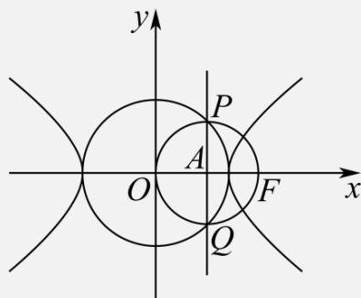

> [!faq]- 《专题18 圆锥曲线》真题解析
>
> > [!success]- **【答案】** A
>
> > [!note]- **【分析】**
> > 【分析】准确画图，由图形对称性得出 $^{P}$ 点坐标，代入圆的方程得到 $^{c}$ 与 $^{a}$ 关系，可求双曲线的离心率。
>
> > [!note]- **【解析】**
> > 【详解】设 PQ 与 x 轴交于点 A，由对称性可知 $PQ \perp x$ 轴，
> > 又∵ $|PQ|=|OF|=c$ ，∴ $|PA|=\frac{c}{2}$ ，∴PA为以OF为直径的圆的半径，
> > ∴ A 为圆心 $|OA|=\frac{c}{2}$ .
> > ∴ $P\left(\frac{c}{2}, \frac{c}{2}\right)$ ，又 P 点在圆 $x^{2} + y^{2} = a^{2}$ 上，
> > $\therefore \frac{c^2}{4} + \frac{c^2}{4} = a^2$ ，即 $\frac{c^2}{2} = a^2$ ， $\therefore e^2 = \frac{c^2}{a^2} = 2$ 。
> > $\therefore e=\sqrt{2}$ ，故选 A.
> > 
> > 【点睛】本题为圆锥曲线离心率的求解，难度适中，审题时注意半径还是直径，优先考虑几何法，避免代数法从头至尾，运算繁琐，准确率大大降低，双曲线离心率问题是圆锥曲线中的重点问题，需强化练习，才能在解决此类问题时事半功倍，信手拈来。
