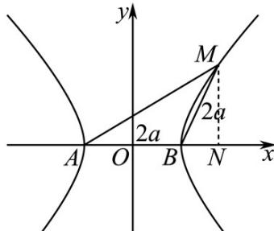

> [!faq]- 《专题18 圆锥曲线》真题解析
>
> > [!success]- **【答案】** D
>
> > [!note]- **【分析】**
> > 本题未单列分析。
>
> > [!note]- **【解析】**
> > 【答案】D
> > 【详解】设双曲线方程为 $\frac{x^2}{a^2} -\frac{y^2}{b^2} = 1(a > 0,b > 0)$ ，如图所示， $\left|AB\right| = \left|BM\right|$ ， $\angle ABM = 120^{\circ}$ ，过点 $M$ 作 $MN\bot x$ 轴，垂足为 $N$ ，在 $Rt\Delta BMN$ 中， $\left|BN\right| = a$ ， $\left|M N\right| = \sqrt{3} a$ ，故点 $M$ 的坐标为 $M(2a,\sqrt{3} a)$ ，代入双曲线方程得 $a^2 = b^2 = a^2 -c^2$ ，即 $c^2 = 2a^2$ ，所以 $e = \sqrt{2}$ ，故选D.
> > 考点：双曲线的标准方程和简单几何性质.
> > 
