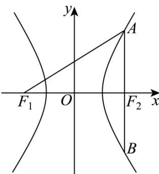

> [!faq]- 《专题18 圆锥曲线》真题解析
>
> > [!success]- **【答案】** 详见解析
>
> > [!note]- **【分析】**
> > 【分析】由题意画出双曲线大致图象，求出 $\left|AF_{2}\right|$ ，结合双曲线第一定义求出 $\left|AF_{1}\right|$ ，即可得到a,b,c的值，从而求出离心率·
>
> > [!note]- **【解析】**
> > 【详解】由题可知 $A, B, F_{2}$ 三点横坐标相等，设 $\mathrm{A}$ 在第一象限，将 $x = c$ 代入 $\frac{x^2}{a^2} - \frac{y^2}{b^2} = 1$
> > 得 $y = \pm \frac{b^2}{a}$ ，即 $A\left(c, \frac{b^2}{a}\right), B\left(c, -\frac{b^2}{a}\right)$ ，故 $|AB| = \frac{2b^2}{a} = 10$ ， $|AF_2| = \frac{b^2}{a} = 5$ ，
> > 又 $\left|AF_1\right| - \left|AF_2\right| = 2a$ ，得 $\left|AF_1\right| = \left|AF_2\right| + 2a = 2a + 5 = 13$ ，解得 $a = 4$ ，代入 $\frac{b^2}{a} = 5$ 得 $b^{2} = 20$
> > 故 $c^2 = a^2 + b^2 = 36$ ，即 $c = 6$ ，所以 $e = \frac{c}{a} = \frac{6}{4} = \frac{3}{2}$ .
> > 故答案为： $\frac{3}{2}$
> > 
