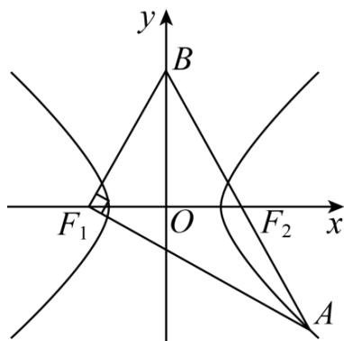

> [!faq]- 《专题18 圆锥曲线》真题解析
>
> > [!success]- **【答案】** $\frac{3\sqrt{5}}{5} / \frac{3}{5}\sqrt{5}$
>
> > [!note]- **【分析】**
> > 方法一：利用双曲线的定义与向量数积的几何意义得到 $\left|AF_{2}\right|,\left|BF_{2}\right|,\left|BF_{1}\right|,\left|AF_{1}\right|$ 关于a,m的表达式，从而利用勾股定理求得a=m，进而利用余弦定理得到a,c的齐次方程，从而得解·
> >
> > 方法二：依题意设出各点坐标，从而由向量坐标运算求得 $x_0 = \frac{5}{3} c, y_0 = -\frac{2}{3} t$ ， $t^2 = 4c^2$ ，将点 $\mathrm{A}$ 代入双曲线 $C$ 得到关于 $a, b, c$ 的齐次方程，从而得解；
>
> > [!note]- **【解析】**
> > 方法一：
> > 依题意，设 $\left|AF_{2}\right|=2m$ ，则 $\left|BF_{2}\right|=3m=\left|BF_{1}\right|,\left|AF_{1}\right|=2a+2m$
> > 在 $\mathrm{Rt}\triangle ABF_{1}$ 中， $9m^{2} + (2a + 2m)^{2} = 25m^{2}$ ，则 $(a + 3m)(a - m) = 0$ ，故 $a = m$ 或 $a = -3m$ （舍去），
> > 所以 $\left|AF_1\right| = 4a,\left|AF_2\right| = 2a$ ， $\left|BF_2\right| = \left|BF_1\right| = 3a$ ，则 $\left|AB\right| = 5a$
> > 故 $\cos\angle F_{1}AF_{2}=\frac{\left|AF_{1}\right|}{\left|AB\right|}=\frac{4a}{5a}=\frac{4}{5}$
> > 所以在 $\triangle AF_1F_2$ 中， $\cos \angle F_1AF_2 = \frac{16a^2 + 4a^2 - 4c^2}{2 \times 4a \times 2a} = \frac{4}{5}$ ，整理得 $5c^2 = 9a^2$
> > 故 $e=\frac{c}{a}=\frac{3\sqrt{5}}{5}$ .
> > 
> > 方法二：
> > 依题意，得 $F_{1}(-c,0), F_{2}(c,0)$ ，令 $A(x_0, y_0), B(0, t)$
> > 因为 $\overline{F_2A} = -\frac{2}{3}\overline{F_2B}$ ，所以 $(x_0 - c, y_0) = -\frac{2}{3} (-c, t)$ ，则 $x_0 = \frac{5}{3} c, y_0 = -\frac{2}{3} t$
> > 又 $\overline{F_1A} \perp \overline{F_1B}$ ，所以 $\overline{F_1A} \cdot \overline{F_1B} = \left(\frac{8}{3} c, -\frac{2}{3} t\right) \cdot (c, t) = \frac{8}{3} c^2 - \frac{2}{3} t^2 = 0$ ，则 $t^2 = 4c^2$ ，又点在 $C$ 上，则 $\frac{\frac{25}{9}c^2}{a^2} -\frac{\frac{4}{9}t^2}{b^2} = 1$ ，整理得 $\frac{25c^2}{9a^2} -\frac{4t^2}{9b^2} = 1$ ，则 $\frac{25c^2}{9a^2} -\frac{16c^2}{9b^2} = 1$
> > 所以 $25c^{2}b^{2} - 16c^{2}a^{2} = 9a^{2}b^{2}$ ，即 $25c^{2}\left(c^{2} - a^{2}\right) - 16a^{2}c^{2} = 9a^{2}\left(c^{2} - a^{2}\right)$
> > 整理得 $25c^4 - 50a^2c^2 + 9a^4 = 0$ ，则 $\left(5c^2 - 9a^2\right)\left(5c^2 - a^2\right) = 0$ ，解得 $5c^2 = 9a^2$ 或 $5c^2 = a^2$
> > 又 $e > 1$ ，所以 $e = \frac{3\sqrt{5}}{5}$ 或 $e = \frac{\sqrt{5}}{5}$ （舍去），故 $e = \frac{3\sqrt{5}}{5}$
> > 故答案为： $\frac{3\sqrt{5}}{5}$
> > 【点睛】关键点睛：双曲线过焦点的三角形的解决关键是充分利用双曲线的定义，结合勾股定理与余弦定理得到关于 $a, b, c$ 的齐次方程，从而得解·
