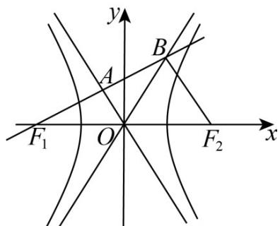

> [!faq]- 《专题18 圆锥曲线》真题解析
>
> > [!success]- **【答案】** 2.
>
> > [!note]- **【分析】**
> > 通过向量关系得到 $F_{1}A = AB$ 和 $OA \perp F_{1}A$ ，得到 $\angle AOB = \angle AOF_{1}$ ，结合双曲线的渐近线可得 $\angle BOF_{2} = \angle AOF_{1}, \angle BOF_{2} = \angle AOF_{1} = \angle BOA = 60^{\circ}$ ，从而由 $\frac{b}{a} = \tan 60^{\circ} = \sqrt{3}$ 可求离心率。
>
> > [!note]- **【解析】**
> > 如图，
> > 
> > 由 $F_{1}A = AB$ ，得 $F_{1}A = AB.$ 又 $OF_{1} = OF_{2}$ ，得OA是三角形 $F_{1}F_{2}B$ 的中位线，即 $BF_{2} / / OA, BF_{2} = 2OA.$ 由
> > $F_{1}B\square F_{2}B=0$ ，得 $F_{1}B\perp F_{2}B,OA\perp F_{1}A,$ 则 $OB=OF_{1}$ 有 $\angle AOB=\angle AOF_{1}$
> > 又 OA 与 OB 都是渐近线，得 $\angle BOF_{2} = \angle AOF_{1}$ ，又 $\angle BOF_{2} + \angle AOB + \angle AOF_{1} = \pi$ ，得
> > $\angle BOF_{2} = \angle AOF_{1} = \angle BOA = 60^{0}$ ，又渐近线OB的斜率为 $\frac{b}{a} = \tan 60^0 = \sqrt{3}$ ，所以该双曲线的离心率为 $e = \frac{c}{a} = \sqrt{1 + (\frac{b}{a})^2} = \sqrt{1 + (\sqrt{3})^2} = 2$
> > 【点睛】本题考查平面向量结合双曲线的渐近线和离心率，渗透了逻辑推理、直观想象和数学运算素养．采取几何法，利用数形结合思想解题．
