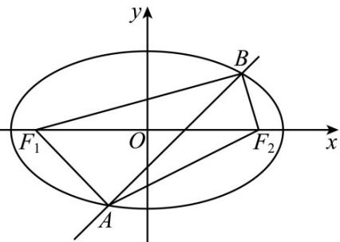

> [!faq]- 《专题18 圆锥曲线》真题解析
>
> > [!success]- **【答案】** C
>
> > [!note]- **【分析】**
> > 首先联立直线方程与椭圆方程，利用 $\Delta > 0$ ，求出 $m$ 范围，再根据三角形面积比得到关于 $m$ 的方程，解出即可·
>
> > [!note]- **【解析】**
> > 将直线 与椭圆联立 $\left\{ \begin{array}{l} y = x + m \\ \frac{x^2}{3} + y^2 = 1 \end{array} \right.$ ，消去 可得 $y = 4x^{2} + 6mx + 3m^{2} - 3 = 0$
> > 因为直线与椭圆相交于 A, B 点，则 $\Delta = 36m^{2} - 4 \times 4(3m^{2} - 3) > 0$ ，解得 -2 < m < 2，
> > 设 $F_{1}$ 到 $AB$ 的距离 $d_{1}, F_{2}$ 到 $AB$ 距离 $d_{2}$ ，易知 $F_{1}(-\sqrt{2}, 0), F_{2}(\sqrt{2}, 0)$
> > 则 $d_{1} = \frac{|-\sqrt{2} + m|}{\sqrt{2}}$ ， $d_{2} = \frac{|\sqrt{2} + m|}{\sqrt{2}}$
> > $\frac{S_{\triangle F_{1}AB}}{S_{\triangle F_{2}AB}}=\frac{\frac{|-\sqrt{2}+m|}{\sqrt{2}}}{\frac{|\sqrt{2}+m|}{\sqrt{2}}}=\frac{|-\sqrt{2}+m|}{|\sqrt{2}+m|}=2$ ，解得 $m=-\frac{\sqrt{2}}{3}$ 或 $-3\sqrt{2}$ （舍去），
> > 故选：C.
> > 
