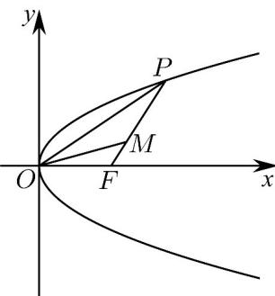

> [!faq]- 《专题18 圆锥曲线》真题解析
>
> > [!success]- **【答案】** C
>
> > [!note]- **【分析】**
> > 首先根据题中的条件，利用点斜式写出直线的方程，涉及到直线与抛物线相交，联立方程组，消元化简，求得两点 $M(1,2),N(4,4)$ ，再利用所给的抛物线的方程，写出其焦点坐标，之后应用向量坐标公式，求得 $FM=(0,2),FN=(3,4)$ ，最后应用向量数量积坐标公式求得结果。
>
> > [!note]- **【解析】**
> > 根据题意，过点 $(-^{2},^{0})$ 且斜率为 $\frac{2}{3}$ 的直线方程为 $y=\frac{2}{3}(x+2)$ ，
> > 与抛物线方程联立 $\left\{\begin{aligned}y&=\frac{2}{3}(x+2)\\ y^{2}&=4x\end{aligned}\right.$ ，消元整理得： $y^{2}-6y+8=0$ 解得 $M(1,2),N(4,4)$ ，又 $F(1,0)$ ，
> > 所以 $FM=(0,2),FN=(3,4)$ ，
> > 从而可以求得 $FM\cdot FN=0\times3+2\times4=8$ ，故选D.
> > 【点睛】该题考查的是有关直线与抛物线相交求有关交点坐标所满足的条件的问题，在求解的过程中，首先需要根据题意确定直线的方程，之后需要联立方程组，消元化简求解，从而确定出 $M(1,2), N(4,4)$ ，之后借助于抛物线的方程求得 $F(1,0)$ ，最后一步应用向量坐标公式求得向量的坐标，之后应用向量数量积坐标公式求得结果，也可以不求点 $^{M}$ 、 $^{N}$ 的坐标，应用韦达定理得到结果。
> > $$
> > y ^ {2} = 2 p x (p > 0)
> > $$
> > 是线段 $PF$ 上的点，且 $\left|PM\right| = 2\left|MF\right|$ ，则直线 $OM$ 的斜率的最大值为（
> > 
> > A. $\frac{\sqrt{3}}{3}$ B. $\frac{2}{3}$ C. $\frac{\sqrt{2}}{2}$ D. 1
> > 【答案】C
> > 【分析】方法一：设 $P\left(\frac{y_0^2}{2p}, y_0\right)$ ，根据题意求出点 $M$ 的坐标，再根据基本不等式即可求出。
> > 【详解】[方法一]：【最优解】直接法
> > 设 $P\left(\frac{y_0^2}{2p}, y_0\right)$ ，由题意知 $F\left(\frac{p}{2}, 0\right)$ ，显然 $y_0 < 0$ 时不符合题意，故 $y_0 > 0$ ，则
> > $\overrightarrow{OM}=\overrightarrow{OF}+\overrightarrow{FM}=\overrightarrow{OF}+\frac{1}{3}\overrightarrow{FP}=\overrightarrow{OF}+\frac{1}{3}(OP-OF)=\frac{1}{3}\overrightarrow{OP}+\frac{2}{3}\overrightarrow{OF}=(\frac{y_{0}^{2}}{6p}+\frac{p}{3},\frac{y_{0}}{3})$ ，可得：
> > $k_{OM}=\frac{\frac{y_{0}}{3}}{\frac{y_{0}^{2}}{6p}+\frac{p}{3}}=\frac{2}{\frac{y_{0}}{p}+\frac{2p}{y_{0}}}\leq\frac{2}{2\sqrt{2}}=\frac{\sqrt{2}}{2}$ ，当且仅当 $y_{0}^{2}=2p^{2},y_{0}=\sqrt{2}p$ 时取等号.
> > 故选：C.
> > [方法二]：参数法
> > 由题意可知： $F(\frac{p}{2},0)$ ，设 P 点坐标为 $(2pt^{2},2pt)(t>0)$ ，M 点坐标为 $(x,y)$ .
> > 则 $\boxed{FM} = \frac{1}{3} \boxed{FP}$ ，即 $\left\{ \begin{array}{l} x = \frac{2pt^2}{3} + \frac{p}{3} \\ y = \frac{2pt}{3} \end{array} \right.$ ，
> > $k_{OM}=\frac{y}{x}=\frac{\frac{2pt}{3}}{\frac{2pt^{2}}{3}+\frac{p}{3}}=\frac{2t}{2t^{2}+1}=\frac{1}{t+\frac{1}{2t}}\leq\frac{1}{2\sqrt{\frac{1}{2}}}=\frac{\sqrt{2}}{2}$ ，当且仅当 $2t^{2}=1$ 等号成立·
> > 则直线 $_{OM}$ 斜率的最大值 $\frac{\sqrt{2}}{2}$
> > 故选：C.
> > [方法三]：几何法
> > 
> > 由题意可知： $F(\frac{p}{2},0)$ ，P点坐标为 $(\frac{y_{0}^{2}}{2p},y_{0})(y_{0}>0)$ ，M点坐标为 $(x,y)$ ，作点O关于点F的对称点 $N(p,0)$ ，
> > 由已知可得点 为 重心，坐标为 $\left(\frac{\frac{y_0^2}{2p} + p}{3},\frac{y_0}{3}\right)$ $M$ △OPN
> > $\therefore k_{ON} = \frac{y}{x} = \frac{1}{\frac{y_0}{2p} + \frac{p}{y_0}} \leq \frac{\sqrt{2}}{2}$ ，当且仅当 $y_0^2 = 2p^2$ 等号成立·
> > 则直线 $OM$ 斜率的最大值 $\frac{\sqrt{2}}{2}$
> > 故选：C.
> > [方法四]：方程法
> > 由题意可知： $F(\frac{p}{2},0)$ ，设P点坐标为 $\left(\frac{y_{0}^{2}}{2p},y_{0}\right)$ ，M点坐标为 $(x,y)$
> > 易知直线 OM 的斜率最大时， $y_{0}>0$ ， $\left|PM\right|=2\left|MF\right|$ ，则 $\overline{PM}=2\overline{MF}$ ，
> > 可得 $(x-\frac{y_{0}^{2}}{2p},y-y_{0})=2(\frac{p}{2}-x,-y)$ ，即 $\left\{\begin{aligned}x&=\frac{p}{3}+\frac{y_{0}^{2}}{6p}\\ y&=\frac{y_{0}}{3}\end{aligned}\right.$
> > 点 $M$ 的轨迹方程为： $9y^{2} = 6px - 2p^{2}$ 与 $y = kx$ 联立
> > 可得 $9k^{2}x^{2} - 6px + 2p^{2} = 0$ ， $\Delta = (-6p)^{2} - 4\times 9k^{2}\times 2p^{2}$ 0
> > $\therefore -\frac{\sqrt{2}}{2} \leq k \leq \frac{\sqrt{2}}{2}$ ，则直线 $OM$ 斜率的最大值 $\frac{\sqrt{2}}{2}$
> > 故选：C.
> > 【整体点评】方法一：设出点 $P$ 的坐标，再求出点 $M$ 坐标，根据基本不等式求出最值，简单高效，是该题的通性通法，也是最优解；
> > 方法二：同方法一几乎一致，只是设点 $P$ 的坐标形式与方法一不同；
> > 方法三：构造三角形，利用三角形重心性质求出点 $M$ 坐标，再基本不等式求出最值；
> > 方法四：先求出点 $M$ 的轨迹方程，根据直线与抛物线的位置关系解出.
