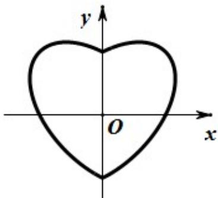

<!-- question-source:start -->
6. (2019·北京·高考真题) 数学中有许多形状优美、寓意美好的曲线，曲线 $C: x^{2} + y^{2} = 1 + |x|y$ 就是其中之一（如图）给出下列三个结论：

① 曲线 $C$ 恰好经过 $^6$ 个整点（即横、纵坐标均为整数的点）；

②曲线 C 上任意一点到原点的距离都不超过 $\sqrt{2}$ ；

③曲线 C 所围成的“心形”区域的面积小于 3.

其中，所有正确结论的序号是
A. ① B. ② C. ①② D. ①②③
<!-- question-source:end -->

![[高中/真题/按题型分类/专题18 圆锥曲线/考点07_曲线方程及曲线轨迹/真题/answers/Q00035263A1.md]]
