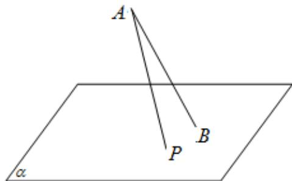

<!-- question-source:start -->
9.（2015·浙江·高考真题）如图，斜线段AB与平面 $\alpha$ 所成的角为 $60^{\circ}$ ， $B$ 为斜足，平面 $\alpha$ 上的动点 $P$ 满足 $\angle PAB = 30^{\circ}$ ，则点 $P$ 的轨迹是

A. 直线 B. 抛物线 C. 椭圆 D. 双曲线的一支
<!-- question-source:end -->

![[高中/真题/按题型分类/专题18 圆锥曲线/考点07_曲线方程及曲线轨迹/真题/answers/Q00035266A1.md]]
