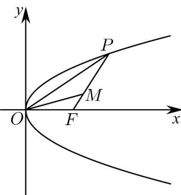

<!-- question-source:start -->
9. (2016·四川·高考真题) 设 O 为坐标原点，P 是以 F 为焦点的抛物线 $y^{2}=2px\left(p>0\right)$ 上任意一点，M 是线段 PF 上的点，且 $\left|PM\right|=2\left|MF\right|$ ，则直线 OM 的斜率的最大值为（）

A. $\frac{\sqrt{3}}{3}$ B. $\frac{2}{3}$ C. $\frac{\sqrt{2}}{2}$ D. 1
<!-- question-source:end -->

![[高中/真题/按题型分类/专题18 圆锥曲线/考点08_圆锥曲线中的最值及范围问题/真题/answers/Q00035274A1.md]]
