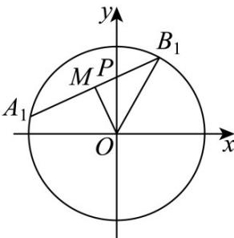

> [!faq]- 《专题18 圆锥曲线》真题解析
>
> > [!success]- **【答案】** B
>
> > [!note]- **【分析】**
> > 因为 $C:\frac{x^{2}}{a^{2}}-\frac{y^{2}}{b^{2}}=1(a>0,b>0)$ ，可得双曲线的渐近线方程是 $y=\pm\frac{b}{a}x$ ，与直线 x=a 联立方程求得 D，E 两点坐标，即可求得 $|ED|$ ，根据 $\triangle ODE$ 的面积为 8，可得 ab 值，根据 $2c=2\sqrt{a^{2}+b^{2}}$ ，结合均值不等式，即可求得答案：
>
> > [!note]- **【解析】**
> > $C:\frac{x^{2}}{a^{2}}-\frac{y^{2}}{b^{2}}=1(a>0,b>0)$
> > $\therefore$ 双曲线的渐近线方程是 $y = \pm \frac{b}{a} x$
> > ∴ 直线 x = a 与双曲线 $C: \frac{x^{2}}{a^{2}} - \frac{y^{2}}{b^{2}} = 1 (a > 0, b > 0)$ 的两条渐近线分别交于 D，E 两点
> > 不妨设 D 为在第一象限，E 在第四象限
> > 联立 $\left\{ \begin{array}{l} x = a \\ y = \frac{b}{a} x \end{array} \right.$ ，解得 $\left\{ \begin{array}{l} x = a \\ y = b \end{array} \right.$ 故 $D(a, b)$ 联立 $\left\{ \begin{array}{l} x = a \\ y = -\frac{b}{a} x \end{array} \right.$ ，解得 $\left\{ \begin{array}{l} x = a \\ y = -b \end{array} \right.$ 故 $E(a, -b)$ $\therefore |ED| = 2b$ $\therefore \triangle ODE$ 面积为： $S_{\triangle ODE} = \frac{1}{2} a \times 2b = ab = 8$ $\therefore$ 双曲线 $C: \frac{x^2}{a^2} - \frac{y^2}{b^2} = 1 (a > 0, b > 0)$ $\therefore$ 其焦距为 $2c = 2\sqrt{a^2 + b^2}$ $2\sqrt{2ab} = 2\sqrt{16} = 8$ 当且仅当 $a = b = 2\sqrt{2}$ 取等号 $\therefore C$ 的焦距的最小值：8
> > 故选：B.
> > 【点睛】本题主要考查了求双曲线焦距的最值问题，解题关键是掌握双曲线渐近线的定义和均值不等式求最值方法，在使用均值不等式求最值时，要检验等号是否成立，考查了分析能力和计算能力，属于中档题·5．（2018·浙江·高考真题）已知点 $P(0,1)$ ，椭圆 $\frac{x^2}{4} + y^2 = m (m > 1)$ 上两点 $A$ ， $B$ 满足 $\overline{AP} = 2PB$ ，则当 $m =$ 时，点 $B$ 横坐标的绝对值最大．
> > 【答案】5
> > 【分析】方法一：先根据条件得到 A, B 坐标间的关系，代入椭圆方程解得 B 的纵坐标，即得 B 的横坐标关于 m 的函数关系，最后根据二次函数性质确定最值即可解出.
> > 【详解】[方法一]：点差法+二次函数性质
> > 设 $A(x_{1},y_{1}),B(x_{2},y_{2})$ ，由 $\overline{AP} = 2\overline{PB}$ 得 $-x_{1} = 2x_{2},1 - y_{1} = 2(y_{2} - 1),\therefore -y_{1} = 2y_{2} - 3,$ 因为 A, B 在椭圆上，所以 $\frac{x_{1}^{2}}{4} + y_{1}^{2} = m, \frac{x_{2}^{2}}{4} + y_{2}^{2} = m, \therefore \frac{4x_{2}^{2}}{4} + (2y_{2} - 3)^{2} = m$ ，即 $\frac{x_{2}^{2}}{4} + (y_{2} - \frac{3}{2})^{2} = \frac{m}{4}$ ，与 $\frac{x_{2}^{2}}{4}+y_{2}^{2}=m$ 相减得： $y_{2}=\frac{3+m}{4}$ ，所以， $x_{2}^{2}=-\frac{1}{4}(m^{2}-10m+9)=-\frac{1}{4}(m-5)^{2}+4\leq4$ ，当且仅当 m=5 时取最等号，即 m=5 时，点 B 横坐标的绝对值最大.
> > 故答案为：5.
> > ## [方法二]：【通性通法】设线+韦达定理
> > 由条件知直线 $AB$ 的斜率存在，设 $A(x_{1},y_{1}),B(x_{2},y_{2})$ ，直线 $AB$ 的方程为 $y = kx + 1 (k \neq 0)$ ，联立 $\left\{ \begin{array}{l} y = kx + 1, \\ \frac{x^2}{4} + y^2 = m, \end{array} \right.$ 得 $(4k^2 + 1)x^2 + 8kx + 4 - 4m = 0$ ，根据韦达定理得 $x_{1} + x_{2} = -\frac{8k}{4k^{2} + 1}$ ，由 $\square \square \square \square \square \square \square \square \square \square \square \square \square \square \square \square \square \square \square \square \square \square \square \square \square \square \square \square$ 知 $x_{1} = -2x_{2}$ ，代入上式解得 $x_{2} = \frac{8k}{4k^{2} + 1}$ ，所以 $|x_{2}| = \frac{8|k|}{4k^{2} + 1} = \frac{8}{4|k| + \frac{1}{|k|}} \leq \frac{8}{2\sqrt{4}} = 2$ 。此时 $k^{2} = \frac{1}{4}$ ，又 $x_{1}x_{2} = \frac{4 - 4m}{4k^{2} + 1} = -2x_{2}^{2} = -8$ ，解得 $m = 5$ 。
> > ## [方法三]：直线的参数方程 $^{+}$ 基本不等式
> > 设直线 $AB$ 的参数方程为 $\left\{ \begin{array}{l} x = t\cos \alpha, \\ y = 1 + t\sin \alpha \end{array} \right.$ 其中 $t$ 为参数， $A$ 为直线 $AB$ 的倾斜角，将其代入椭圆方程中化简得 $(1 + 3\sin^2\alpha)t^2 + 8t\sin \alpha + 4 - 4m = 0$ ，设点 $A, B$ 对应的参数分别为 $t_1, t_2$ ，则 $t_1 = -2t_2$ 。由韦达定理知 $t_1 + t_2 = -\frac{8\sin \alpha}{1 + 3\sin^2\alpha}, t_1t_2 = \frac{4 - 4m}{1 + 3\sin^2\alpha}$ ，解得 $t_2 = \frac{8\sin \alpha}{1 + 3\sin^2\alpha}$ ，所以
> > $$
> > x _ {2} ^ {2} = t _ {2} ^ {2} \cos^ {2} \alpha = \frac {6 4 \sin^ {2} \alpha \cos^ {2} \alpha}{(1 + 3 \sin^ {2} \alpha) ^ {2}} = 1 6 \times \frac {\cos^ {2} \alpha}{1 + 3 \sin^ {2} \alpha} \cdot \frac {4 \sin^ {2} \alpha}{1 + 3 \sin^ {2} \alpha} \leq 1 6 \times \left(\frac {\frac {\cos^ {2} \alpha}{1 + 3 \sin^ {2} \alpha} + \frac {4 \sin^ {2} \alpha}{1 + 3 \sin^ {2} \alpha}}{2}\right) ^ {2} = 4
> > $$
> > $\cos^2\alpha = 4\sin^2\alpha$ ，即 $\cos^2\alpha = \frac{4}{5},\sin^2\alpha = \frac{1}{5},t_2^2 = 5$ ，代入 $t_1 = -2t_2,t_1t_2 = \frac{4 - 4m}{1 + 3\sin^2\alpha}$ ，解得 $m = 5$ ：
> > ## [方法四]：直接硬算求解 $^{+}$ 二次函数性质
> > 设 $A(x_{1},y_{1}),B(x_{2},y_{2})$ ，因为 $\overline{AP} = 2\overline{PB}$ ，所以 $(-x_{1},1 - y_{1}) = 2(x_{2},y_{2} - 1)$
> > 即 $x_{1} = -2x_{2}$ ①， $y_{1} + 2y_{2} = 3$ ②，
> > 又因为 $\frac{x_1^2}{4} + y_1^2 = m, \frac{x_2^2}{4} + y_2^2 = m$ ，所以 $\frac{4x_2^2}{4} + y_1^2 = m$ 。
> > 不妨设 $y_{2} > 0$ ，因此 $\left|y_1\right| = \sqrt{m - x_2^2}, y_2 = \sqrt{m - \frac{x_2^2}{4}}$ ，代入②式可得 $\left(\sqrt{m - x_2^2}\right)^2 = \left(3 - \sqrt{4m - x_2^2}\right)^2$ 。化简整理得 $4x_{2}^{2} = -m^{2} + 10m - 9 = -(m - 5)^{2} + 16$
> > 由此可知，当 $m = 5$ 时，上式有最大值16，即点 $B$ 横坐标的绝对值有最大值2.
> > $$
> > m = 5
> > $$
> > ## [方法五]：【最优解】仿射变换
> > 如图1，作如下仿射变换 $\left\{ \begin{array}{l}x = 2x_{1}\\ y = y_{1} \end{array} \right.$ ，则 $x_{1}^{2} + y_{1}^{2} = m(m > 1)$ 为一个圆.
> > 
> > 图1
> > 根据仿射变换的性质，点 $B$ 的横坐标的绝对值最大，等价于点 $B_{1}$ 的横坐标的绝对值最大，则 $\left|x_{B_1}\right| = \left|PB_1\right|\cos \angle POM = 2\left|PM\right|\cos \angle POM = 2\left|OP\right|\sin \angle POM\cos \angle POM$ $= |OP|\cdot \sin 2\angle POM\leq |OP|$
> > 当 $\angle POM = \frac{\pi}{4}$ 时等号成立，根据 $|OP| = 1$ 易得 $\left|OB_1\right| = \sqrt{5}$ ，此时 $m = 5$ 。
> > ## [方法六]：中点弦性质的应用
> > 设 $B(x_{2},y_{2})$ ，由 $\square AP = 2PB$ 可知 $A(-2x_2,3 - 2y_2)$ ，则 $AB$ 中点 $M\left(-\frac{x_2}{2},\frac{3 - y_2}{2}\right)$ .因为 $k_{AB}\cdot k_{CM} = -\frac{b^2}{a^2}$ ，所以 $\frac{3 - y_2}{x_2}\cdot \frac{y_2 - 1}{x_2} = -\frac{1}{4}$ ，整理得 $\frac{x_2^2}{4} +(y_2 - 2)^2 = 1$ ，由于 $|x_2|\leq 2$ ，则 $|x_2|_{\max} = 2$ 时， $y_{2} = 2$ ，所以 $m = \frac{4}{4} +4 = 5$ 【整体点评】方法一：由题意中点 $A,B$ 的坐标关系，以及点差法可求出点 $B$ 的横、纵坐标，从而可以根据二次函数的性质解出；
> > 方法二：常规设线，通过联立，根据韦达定理以及题目条件求出点 $B$ 的横坐标，然后利用基本不等式求出最值，由取等条件得解，是该题的通性通法；
> > 方法三：利用直线的参数方程与椭圆方程联立，根据参数的几何意义，解得点 $B$ 的横坐标，再利用基本不等式求出最值，由取等条件得解；
> > 方法四：利用题目条件硬算求出点 B 的横坐标，再根据二次函数的性质解出；
> > 方法五：根据仿射变换，利用圆的几何性质结合平面几何知识转化，求出对应点的横坐标的绝对值最大，从而解出，计算难度小，是该题的最优解；
> > 方法六：利用中点弦的性质找出点 $B$ 的横、纵坐标关系，再根据关系式自身特征求出点 $B$ 的横坐标的绝对值的最大值，从而解出，计算量小，也是不错的方法。
