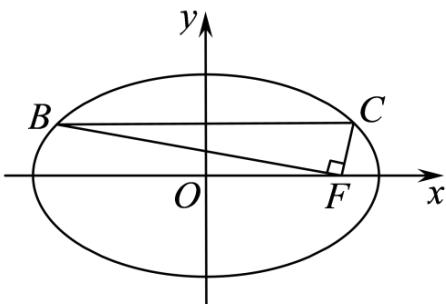

<!-- question-source:start -->
16．（2016·江苏·高考真题）如图，在平面直角坐标系 $xOy$ 中， $F$ 是椭圆 $\frac{x^2}{a^2} + \frac{y^2}{b^2} = 1 (a > b > 0)$ 的右焦点，直线 $y = \frac{b}{2}$ 与椭圆交于 $B, C$ 两点，且 $\angle BFC = 90^\circ$ ，则该椭圆的离心率是 \_\_\_\_。

<!-- question-source:end -->

![[高中/真题/按题型分类/专题18 圆锥曲线/考点_04_椭圆的离心率及其应用/真题/answers/Q00035197A1.md]]
