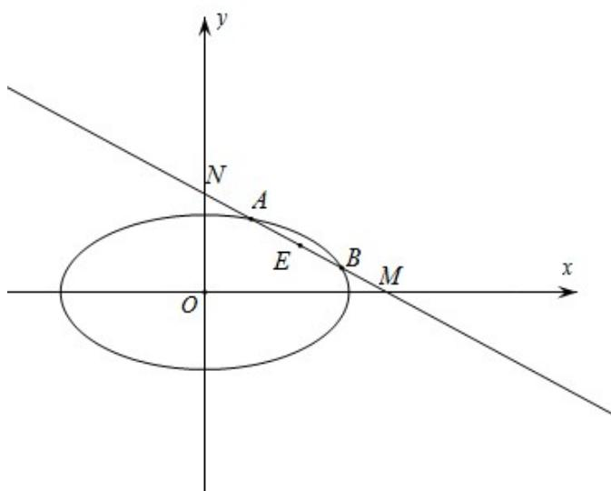

> [!faq]- 《专题18 圆锥曲线》真题解析
>
> > [!success]- **【答案】** 详见解析
>
> > [!note]- **【分析】**
> > 【分析】令 $AB$ 的中点为 $E$ ，设 $A(x_1, y_1)$ ， $B(x_2, y_2)$ ，利用点差法得到 $k_{OE} \cdot k_{AB} = -\frac{1}{2}$ ，设直线 $AB: y = kx + m$ ， $k < 0$ ， $m > 0$ ，求出 $M$ 、 $N$ 的坐标，再根据 $|MN|$ 求出 $k$ 、 $m$ ，即可得解；
>
> > [!note]- **【解析】**
> > ## 【详解】[方法一]：弦中点问题：点差法
> > 令 $AB$ 的中点为 $E$ ，设 $A(x_1, y_1)$ ， $B(x_2, y_2)$ ，利用点差法得到 $k_{OE} \cdot k_{AB} = -\frac{1}{2}$ ，
> > 设直线 $AB:y = kx + m$ ， $k <   0$ ， $m > 0$ ，求出 $M$ 、 $N$ 的坐标，
> > 再根据 $|MN|$ 求出k、m，即可得解；
> > 解：令 $AB$ 的中点为 $E$ ，因为 $\left|MA\right| = \left|NB\right|$ ，所以 $\left|ME\right| = \left|NE\right|$
> > 设 $A(x_{1},y_{1})$ ， $B(x_{2},y_{2})$ ，则 $\frac{x_1^2}{6} +\frac{y_1^2}{3} = 1$ ， $\frac{x_2^2}{6} +\frac{y_2^2}{3} = 1$
> > 所以 $\frac{x_1^2}{6} -\frac{x_2^2}{6} +\frac{y_1^2}{3} -\frac{y_2^2}{3} = 0$ ，即 $\frac{(x_1 - x_2)(x_1 + x_2)}{6} +\frac{(y_1 + y_2)(y_1 - y_2)}{3} = 0$
> > 所以 $\frac{(y_1 + y_2)(y_1 - y_2)}{(x_1 - x_2)(x_1 + x_2)} = -\frac{1}{2}$ ，即 $k_{OE} \cdot k_{AB} = -\frac{1}{2}$ ，设直线 $AB: y = kx + m$ ， $k < 0$ ， $m > 0$ ，
> > 令 $x = 0$ 得 $y = m$ ，令 $y = 0$ 得 $x = -\frac{m}{k}$ ，即 $M\left(-\frac{m}{k},0\right)$ ， $N(0,m)$
> > 所以 $E\left(-\frac{m}{2k}, \frac{m}{2}\right)$
> > 即 $k \times \frac{\frac{m}{2}}{-\frac{m}{2k}} = -\frac{1}{2}$ ，解得 $k = -\frac{\sqrt{2}}{2}$ 或 $k = \frac{\sqrt{2}}{2}$ （舍去），
> > 又 $\left|MN\right|=2\sqrt{3}$ ，即 $\left|MN\right|=\sqrt{m^{2}+\left(\sqrt{2}m\right)^{2}}=2\sqrt{3}$ ，解得m=2或m=-2（舍去），
> > 所以直线 $AB:y = -\frac{\sqrt{2}}{2} x + 2$ ，即 $x + \sqrt{2} y - 2\sqrt{2} = 0$
> > 
> > 故答案为： $x + \sqrt{2}y - 2\sqrt{2} = 0$
> > [方法二]：直线与圆锥曲线相交的常规方法
> > 解：由题意知，点 $E$ 既为线段 $AB$ 的中点又是线段 ${}^{\mathrm{MN}}$ 的中点，
> > 设 $A(x_{1},y_{1})$ ， $B(x_{2},y_{2})$ ，设直线 $AB:y = kx + m$ ， $k <   0$ ， $m > 0$
> > 则 $M\left(-\frac{m}{k},0\right)$ ， $N(0,m)$ ， $E\left(-\frac{m}{2k},\frac{m}{2}\right)$ ，因为 $\left|MN\right| = 2\sqrt{3}$ ，所以 $\left|OE\right| = \sqrt{3}$
> > 联立直线 $^{AB}$ 与椭圆方程得 $\left\{\begin{aligned}y&=kx+m\\ \frac{x^{2}}{6}&+\frac{y^{2}}{3}=1\end{aligned}\right.$ 消掉Y得 $(1+2k^{2})x^{2}+4mkx+2m^{2}-6=0$
> > 其中 $\Delta = (4mk)^2 - 4(1 + 2k^2)(2m^2 - 6) > 0, x_1 + x_2 = -\frac{4mk}{1 + 2k^2}$
> > ∴AB 中点 E 的横坐标 $x_{E} = -\frac{2mk}{1 + 2k^{2}}$ ，又 $E\left(-\frac{m}{2k}, \frac{m}{2}\right)$ ，∴ $x_{E} = -\frac{2mk}{1 + 2k^{2}} = -\frac{m}{2k}$
> > $\because k<0,\ m>0,\therefore k=-\frac{\sqrt{2}}{2}, 又\left|OE\right|=\sqrt{\left(-\frac{m}{2k}\right)^{2}+\left(\frac{m}{2}\right)^{2}}=\sqrt{3}$ ，解得 m=2
> > 所以直线 $AB:y = -\frac{\sqrt{2}}{2} x + 2$ ，即 $x + \sqrt{2} y - 2\sqrt{2} = 0$
