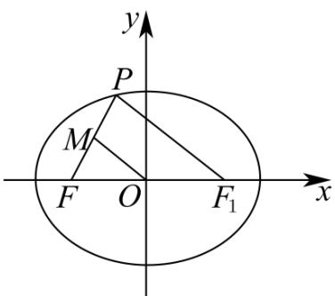

> [!faq]- 《专题18 圆锥曲线》真题解析
>
> > [!success]- **【答案】** 详见解析
>
> > [!note]- **【分析】**
> > 【分析】结合图形可以发现，利用三角形中位线定理，将线段长度用坐标表示成圆的方程，与椭圆方程联立可进一步求解·利用焦半径及三角形中位线定理，则更为简洁·
>
> > [!note]- **【解析】**
> > 【详解】方法 $^{1}$ ：由题意可知 $|OF|=|OM|=c=2$
> > 由中位线定理可得 $\left|PF_{1}\right|=2\left|OM\right|=4$ ，设 $P(x,y)$ 可得 $(x-2)^{2}+y^{2}=16$ ，
> > 联立方程 $\frac{x^{2}}{9}+\frac{y^{2}}{5}=1$
> > 可解得 $x = -\frac{3}{2}, x = \frac{21}{2}$ （舍），点 $P$ 在椭圆上且在 $x$ 轴的上方，
> > 求得 $P\left(-\frac{3}{2}, \frac{\sqrt{15}}{2}\right)$ ，所以 $k_{PF} = \frac{\frac{\sqrt{15}}{2}}{\frac{1}{2}} = \sqrt{15}$
> > 
> > 方法 $^{2}$ ：焦半径公式应用
> > 解析 $^{1}$ ：由题意可知 $\left|OF\right|=\left|OM\right|=c=2$
> > 由中位线定理可得 $\left|PF_{1}\right|=2\left|OM\right|=4$ ，即 $a-ex_{p}=4\Rightarrow x_{p}=-\frac{3}{2}$
> > 求得 $P\left(-\frac{3}{2},\frac{\sqrt{15}}{2}\right)$ ，所以 $k_{PF}=\frac{\frac{\sqrt{15}}{2}}{\frac{1}{2}}=\sqrt{15}$ .
> > 【点睛】本题主要考查椭圆的标准方程、椭圆的几何性质、直线与圆的位置关系，利用数形结合思想，是解答解析几何问题的重要途径·
