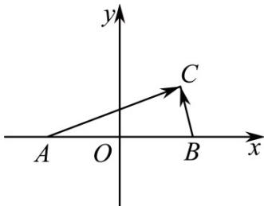

> [!faq]- 《专题18 圆锥曲线》真题解析
>
> > [!success]- **【答案】** A
>
> > [!note]- **【分析】**
> > 【分析】首先建立平面直角坐标系，然后结合数量积的定义求解其轨迹方程即可·
>
> > [!note]- **【解析】**
> > 【详解】设 $AB = 2a(a > 0)$ ，以 $AB$ 中点为坐标原点建立如图所示的平面直角坐标系，
> > 
> > 则： $A(-a,0),B(a,0)$ ，设 $C(x,y)$ ，可得： $\vec{AC} = (x + a,y),\vec{BC} = (x - a,y)$
> > 从而： $\vec{AC}\cdot\vec{BC}=(x+a)(x-a)+y^{2}$
> > 结合题意可得： $(x+a)(x-a)+y^{2}=1$
> > 整理可得： $x^{2} + y^{2} = a^{2} + 1$
> > 即点 $C$ 的轨迹是以 $AB$ 中点为圆心， $\sqrt{a^2 + 1}$ 为半径的圆·
> > 故选：A.
> > 【点睛】本题主要考查平面向量及其数量积的坐标运算，轨迹方程的求解等知识，意在考查学生的转化能力和计算求解能力·
