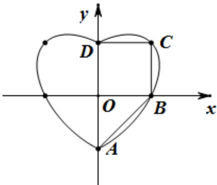

> [!faq]- 《专题18 圆锥曲线》真题解析
>
> > [!success]- **【答案】** C
>
> > [!note]- **【分析】**
> > 【分析】将所给方程进行等价变形确定 $^{X}$ 的范围可得整点坐标和个数，结合均值不等式可得曲线上的点到坐标原点距离的最值和范围，利用图形的对称性和整点的坐标可确定图形面积的范围.
>
> > [!note]- **【解析】**
> > 【详解】由 $x^{2} + y^{2} = 1 + |x|y$ 得， $y^{2} - |x|y = 1 - x^{2}, \left(y - \frac{|x|}{2}\right)^{2} = 1 - \frac{3x^{2}}{4}, 1 - \frac{3x^{2}}{4}..0, x^{2}, \frac{4}{3}$ ，
> > 所以 x 可为的整数有 0, -1, 1, 从而曲线 $C: x^{2} + y^{2} = 1 + |x|y$ 恰好经过 $(0, 1), (0, -1), (1, 0), (1, 1), (-1, 0), (-1, 1)$ 六个整点，结论①正确·
> > 由 $x^{2} + y^{2} = 1 + |x|y$ 得， $x^{2} + y^{2}, 1 + \frac{x^{2} + y^{2}}{2}$ ，解得 $x^{2} + y^{2} \leq 2$ ，所以曲线 $C$ 上任意一点到原点的距离都不超过 $\sqrt{2}$ 结论②正确·
> > 如图所示,易知 $A(0,-1)$ , $B(1,0)$ , $C(1,1)$ , $D(0,1)$ ,
> > 四边形 ABCD 的面积 $S_{ABCD} = \frac{1}{2} \times 1 \times 1 + 1 \times 1 = \frac{3}{2}$ ，很明显“心形”区域的面积大于 $2S_{ABCD}$ ，即“心形”区域的面积大于
> > 3,说法③错误.
> > 
> > 故选 C.
> > 【点睛】本题考查曲线与方程、曲线的几何性质，基本不等式及其应用，属于难题，注重基础知识、基本运算能力及分析问题解决问题的能力考查，渗透“美育思想”
