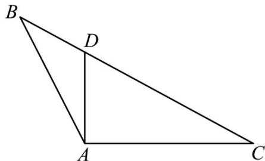

<!-- question-source:start -->
6. (2017·全国·高考真题) $\Delta ABC$ 的内角 $A, B, C$ 的对边分别为 $a, b, c$ , 已知 $\sin A + \sqrt{3} \cos A = 0, a = 2\sqrt{7}, b = 2$ .

(1) 求角 A 和边长 c ;

(2) 设 D 为 BC 边上一点，且 $AD \perp AC$ ，求 $\Delta ABD$ 的面积.
<!-- question-source:end -->

![[高中/真题/按题型分类/专题19 解三角形大题综合/考点01_求面积的值及范围或最值/真题/answers/Q00035285A1.md]]
