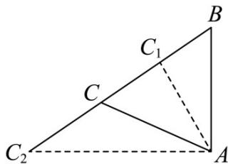

> [!faq]- 《专题19 解三角形大题综合》真题解析
>
> > [!success]- **【答案】** 详见解析
>
> > [!note]- **【分析】**
> > (1)利用正弦定理化简题中等式，得到关于 $^{B}$ 的三角方程，最后根据A,B,C均为三角形内角解得 $B=\frac{\pi}{3}$ .
> >
> > (2)根据三角形面积公式 $S_{\triangle ABC} = \frac{1}{2} ac \cdot \sin B$ ，又根据正弦定理和 $c = 1$ 得到 $S_{\triangle ABC}$ 关于 $C$ 的函数，由于 $\triangle ABC$ 是锐角三角形，所以利用三个内角都小于 $\frac{\pi}{2}$ 来计算 $C$ 的定义域，最后求解 $S_{\triangle ABC}(C)$ 的值域。
>
> > [!note]- **【解析】**
> > (1)
> > [方法一]【最优解：利用三角形内角和为 $\pi$ 结合正弦定理求角度】
> > 由三角形的内角和定理得 $\frac{A + C}{2} = \frac{\pi}{2} -\frac{B}{2}$
> > 此时 $a\sin \frac{A + C}{2} = b\sin A$ 就变为 $a\sin \left(\frac{\pi}{2} -\frac{B}{2}\right) = b\sin A$
> > 由诱导公式得 $\sin \left(\frac{\pi}{2} -\frac{B}{2}\right) = \cos \frac{B}{2}$ ，所以 $a\cos \frac{B}{2} = b\sin A$
> > 在 $\triangle ABC$ 中，由正弦定理知 $a = 2R\sin A, b = 2R\sin B$
> > 此时就有 $\sin A\cos \frac{B}{2} = \sin A\sin B$ ，即 $\cos \frac{B}{2} = \sin B$
> > 再由二倍角的正弦公式得 $\cos \frac{B}{2} = 2\sin \frac{B}{2}\cos \frac{B}{2}$ ，解得 $B = \frac{\pi}{3}$
> > ## [方法二]【利用正弦定理解方程求得 $\cos B$ 的值可得 $\angle B$ 的值】
> > 由解法 1 得 $\sin \frac{A + C}{2} = \sin B$
> > 两边平方得 $\sin^2\frac{A + C}{2} = \sin^2 B$ ，即 $\frac{1 - \cos(A + C)}{2} = \sin^2 B$
> > 又 $A + B + C = 180^{\circ}$ ，即 $\cos (A + C) = -\cos B$ ，所以 $1 + \cos B = 2\sin^2 B$
> > 进一步整理得 $2\cos^2 B + \cos B - 1 = 0$
> > 解得 $\cos B = \frac{1}{2}$ ，因此 $B = \frac{\pi}{3}$
> > ## [方法三]【利用正弦定理结合三角形内角和为 $\pi$ 求得 $A, B, C$ 的比例关系】
> > 根据题意 $a\sin \frac{A + C}{2} = b\sin A$ ，由正弦定理得 $\sin A\sin \frac{A + C}{2} = \sin B\sin A$
> > 因为 $0 < A < \pi$ ，故 $\sin A > 0$
> > 消去 $\sin A$ 得 $\sin \frac{A + C}{2} = \sin B$
> > $0 < B < \pi$ ， $0 < \frac{A + C}{2} < \pi$ ，因为故 $\frac{A + C}{2} = B$ 或者 $\frac{A + C}{2} + B = \pi$
> > 而根据题意 $A + B + C = \pi$ ，故 $\frac{A + C}{2} + B = \pi$ 不成立，所以 $\frac{A + C}{2} = B$
> > 又因为 $A + B + C = \pi$ ，代入得 $3B = \pi$ ，所以 $B = \frac{\pi}{3}$ .
> > (2)
> > ## [方法一]【最优解：利用锐角三角形求得 $C$ 的范围，然后由面积函数求面积的取值范围】
> > 因为 $\triangle ABC$ 是锐角三角形，又 $B = \frac{\pi}{3}$ ，所以 $\frac{\pi}{6} < A < \frac{\pi}{2}, \frac{\pi}{6} < C < \frac{\pi}{2}$ ，
> > $$
> > S _ {\mathrm{V} A B C} = \frac {1}{2} a c \sin B = \frac {1}{2} c ^ {2} \cdot \frac {a}{c} \cdot \sin B = \frac {\sqrt {3}}{4} \cdot \frac {\sin A}{\sin C} = \frac {\sqrt {3}}{4} \cdot \frac {\sin \left(\frac {2 \pi}{3} - C\right)}{\sin C} =
> > $$
> > $$
> > \frac {\sqrt {3}}{4} \cdot \frac {\sin \frac {2 \pi}{3} \cos C - \cos \frac {2 \pi}{3} \sin C}{\sin C} = \frac {3}{8 \tan C} + \frac {\sqrt {3}}{8}
> > $$
> > 因为 $C \in \left(\frac{\pi}{6}, \frac{\pi}{2}\right)$ ，所以 $\tan C \in \left(\frac{\sqrt{3}}{3}, +\infty\right)$ ，则 $\frac{1}{\tan C} \in (0, \sqrt{3})$ ，
> > 从而 $S_{\triangle ABC} \in \left(\frac{\sqrt{3}}{8}, \frac{\sqrt{3}}{2}\right)$ ，故 $\triangle ABC$ 面积的取值范围是 $\left(\frac{\sqrt{3}}{8}, \frac{\sqrt{3}}{2}\right)$
> > ## [方法二]【由题意求得边 $a$ 的取值范围，然后结合面积公式求面积的取值范围】
> > 由题设及（1）知 $\triangle ABC$ 的面积 $S_{\triangle ABC} = \frac{\sqrt{3}}{4} a$
> > 因为 $\triangle ABC$ 为锐角三角形，且 $c = 1, B = \frac{\pi}{3}$ ，
> > 所以 $\left\{ \begin{array}{l} \cos A = \frac{b^2 + 1 - a^2}{2b} > 0, \\ \cos C = \frac{b^2 + a^2 - 1}{2ab} > 0, \end{array} \right.$ 即 $\left\{ \begin{array}{l} b^2 + 1 - a^2 > 0, \\ b^2 + a^2 - 1 > 0. \end{array} \right.$
> > 又由余弦定理得 $b^{2} = a^{2} + 1 - a$ ，所以 $\left\{ \begin{array}{l}2 - a > 0,\\ 2a^2 -a > 0, \end{array} \right.$ 即 $\frac{1}{2} <  a <   2$
> > 所以 $\frac{\sqrt{3}}{8} < S_{\triangle ABC} < \frac{\sqrt{3}}{2}$ ，故 $\triangle ABC$ 面积的取值范围是 $\left(\frac{\sqrt{3}}{8}, \frac{\sqrt{3}}{2}\right)$
> > ## [方法三]【数形结合，利用极限的思想求解三角形面积的取值范围】
> > 如图，在 $\triangle ABC$ 中，过点 $A$ 作 $AC_{1} \perp BC$ ，垂足为 $C_{1}$ ，作 $AC_{2} \perp AB$ 与 $BC$ 交于点 $C_{2}$ ：
> > 由题设及（1）知 $\triangle ABC$ 的面积 $S_{\triangle ABC} = \frac{\sqrt{3}}{4} a$ ，因为 $\triangle ABC$ 为锐角三角形，且 $c = 1, B = \frac{\pi}{3}$
> > 所以点 C 位于在线段 $C_{1}C_{2}$ 上且不含端点，从而 $c \cdot \cos B < a < \frac{c}{\cos B}$ ，
> > 即 $\cos\frac{\pi}{3}<a<\frac{1}{\cos\frac{\pi}{3}}$ ，即 $\frac{1}{2}<a<2$ ，所以 $\frac{\sqrt{3}}{8}<S_{\triangle ABC}<\frac{\sqrt{3}}{2}$ ，
> > 故 $\triangle ABC$ 面积的取值范围是 $\left(\frac{\sqrt{3}}{8},\frac{\sqrt{3}}{2}\right)$
> > 
> > 【整体点评】 $^{(1)}$ 方法一：正弦定理是解三角形的核心定理，与三角形内角和相结合是常用的方法；
> > 方法二：方程思想是解题的关键，解三角形的问题可以利用余弦值确定角度值；
> > 方法三：由正弦定理结合角度关系可得内角的比例关系，从而确定角的大小
> > (2)方法一：由题意结合角度的范围求解面积的范围是常规的做法；
> > 方法二：将面积问题转化为边长的问题，然后求解边长的范围可得面积的范围；
> > 方法三：极限思想和数形结合体现了思维的灵活性，要求学生对几何有深刻的认识和灵活的应用·
