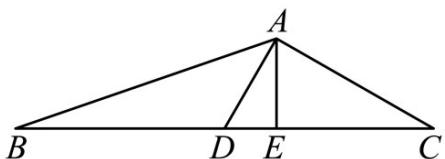

> [!faq]- 《专题19 解三角形大题综合》真题解析
>
> > [!success]- **【答案】** 详见解析
>
> > [!note]- **【分析】**
> > （1）方法 $^{1}$ ，利用三角形面积公式求出a，再利用余弦定理求解作答；方法 $^{2}$ ，利用三角形面积公式求出a，作出BC边上的高，利用直角三角形求解作答.
> >
> > (2) 方法 $^{1}$ ，利用余弦定理求出 a，再利用三角形面积公式求出 $\angle ADC$ 即可求解作答；方法 $^{2}$ ，利用向量运算律建立关系求出 a，再利用三角形面积公式求出 $\angle ADC$ 即可求解作答.
>
> > [!note]- **【解析】**
> > （1）方法 $^{1}$ ：在 $\triangle ABC$ 中，因为D为BC中点， $\angle ADC=\frac{\pi}{3}$ ，AD=1，
> > 
> > 则 $S_{\triangle ADC} = \frac{1}{2} AD \cdot DC \sin \angle ADC = \frac{1}{2} \times 1 \times \frac{1}{2} a \times \frac{\sqrt{3}}{2} = \frac{\sqrt{3}}{8} a = \frac{1}{2} S_{\triangle ABC} = \frac{\sqrt{3}}{2}$ ，解得 $a = 4$ ，
> > 在 $\triangle ABD$ 中， $\angle ADB = \frac{2\pi}{3}$ ，由余弦定理得 $c^2 = BD^2 + AD^2 - 2BD \cdot AD \cos \angle ADB$ ，
> > 即 $c^2 = 4 + 1 - 2 \times 2 \times 1 \times \left(-\frac{1}{2}\right) = 7$ ，解得 $c = \sqrt{7}$ ，则 $\cos B = \frac{7 + 4 - 1}{2\sqrt{7} \times 2} = \frac{5\sqrt{7}}{14}$
> > $\sin B = \sqrt{1 - \cos^2 B} = \sqrt{1 - (\frac{5\sqrt{7}}{14})^2} = \frac{\sqrt{21}}{14}$
> > 所以 $\tan B = \frac{\sin B}{\cos B} = \frac{\sqrt{3}}{5}$ .
> > 方法 $^{2}$ ：在 $\triangle ABC$ 中，因为 D 为 BC 中点， $\angle ADC = \frac{\pi}{3}$ ，AD = 1，
> > 则 $S_{\triangle ADC} = \frac{1}{2} AD \cdot DC \sin \angle ADC = \frac{1}{2} \times 1 \times \frac{1}{2} a \times \frac{\sqrt{3}}{2} = \frac{\sqrt{3}}{8} a = \frac{1}{2} S_{\triangle ABC} = \frac{\sqrt{3}}{2}$ ，解得 a = 4，
> > 在 $\triangle ACD$ 中，由余弦定理得 $b^{2} = CD^{2} + AD^{2} - 2CD\cdot AD\cos \angle ADC$
> > 即 $b^{2}=4+1-2\times2\times1\times\frac{1}{2}=3$ ，解得 $b=\sqrt{3}$ ，有 $AC^{2}+AD^{2}=4=CD^{2}$ ，则 $\angle CAD=\frac{\pi}{2}$ ，
> > $C=\frac{\pi}{6}$ ，过 A 作 $AE\perp BC$ 于 E，于是 $CE=AC\cos C=\frac{3}{2}, AE=AC\sin C=\frac{\sqrt{3}}{2}$ ， $BE=\frac{5}{2}$
> > 所以 $\tan B = \frac{AE}{BE} = \frac{\sqrt{3}}{5}$ .
> > (2) 方法 $^{1}$ ：在与中，由余弦定理得 $\left\{\begin{aligned}&c^{2}=\frac{1}{4}a^{2}+1-2\times\frac{1}{2}a\times1\times\cos(\pi-\angle ADC)\\&b^{2}=\frac{1}{4}a^{2}+1-2\times\frac{1}{2}a\times1\times\cos\angle ADC\end{aligned}\right.$
> > 整理得 $\frac{1}{2} a^2 + 2 = b^2 + c^2$ ，而 $b^2 + c^2 = 8$ ，则 $a = 2\sqrt{3}$ ，
> > 又 $S_{\triangle ADC} = \frac{1}{2}\times \sqrt{3}\times 1\times \sin \angle ADC = \frac{\sqrt{3}}{2}$ ，解得 $\sin \angle ADC = 1$ ，而 $0 <   \angle ADC <   \pi$ ，于是 $\angle ADC = \frac{\pi}{2}$
> > 所以 $b = c = \sqrt{AD^{2} + CD^{2}} = 2$ .
> > 方法 $^{2}$ ：在 $\triangle ABC$ 中，因为 D 为 BC 中点，则 $2\overline{AD} = \overline{AB} + \overline{AC}$ ，又 $CB = AB - AC$
> > 于是 $4\overline{AD}^2 +\overline{CB}^2 = (\overline{AB} +\overline{AC})^2 +(\overline{AB} -\overline{AC})^2 = 2(b^2 +c^2) = 16$ ，即 $4 + a^{2} = 16$ ，解得 $a = 2\sqrt{3}$
> > 又 $S_{\triangle ADC} = \frac{1}{2}\times \sqrt{3}\times 1\times \sin \angle ADC = \frac{\sqrt{3}}{2}$ ，解得 $\sin \angle ADC = 1$ ，而 $0 <   \angle ADC <   \pi$ ，于是 $\angle ADC = \frac{\pi}{2}$
> > 所以 $b = c = \sqrt{AD^{2} + CD^{2}} = 2$ .
