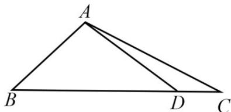

<!-- question-source:start -->
8．（2020·江苏·高考真题）在△ABC中，角A，B，C的对边分别为a，b，c，已知 $a=3,c=\sqrt{2},B=45^{\circ}$

(1) 求 $\sin C$ 的值；

(2) 在边 $BC$ 上取一点 $D$ ，使得 $\cos \angle ADC = -\frac{4}{5}$ ，求 $\tan \angle DAC$ 的值。
<!-- question-source:end -->

![[高中/真题/按题型分类/专题19 解三角形大题综合/考点03_求角和三角函数的值及范围或最值/真题/answers/Q00035313A1.md]]
