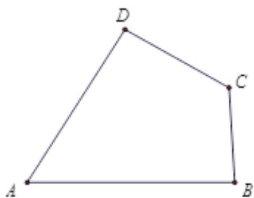

<!-- question-source:start -->
25. (2015·四川·高考真题) 如图, A, B, C, D 为平面四边形 ABCD 的四个内角.

(1) 证明： $\tan\frac{A}{2}=\frac{1-\cos A}{\sin A};$

(2) 若 $A + C = 180^{\circ}, AB = 6, BC = 3, CD = 4, AD = 5$ , 求 $\tan \frac{A}{2} + \tan \frac{B}{2} + \tan \frac{C}{2} + \tan \frac{D}{2}$ 的值.
<!-- question-source:end -->

![[高中/真题/按题型分类/专题19 解三角形大题综合/考点03_求角和三角函数的值及范围或最值/真题/answers/Q00035329A1.md]]
