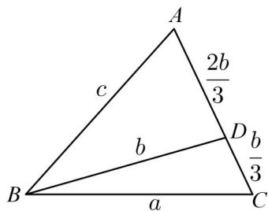
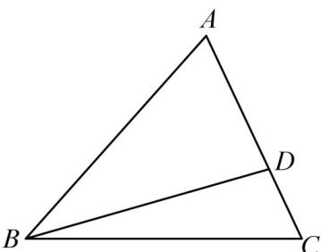
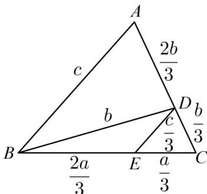
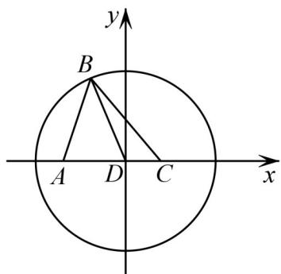

> [!faq]- 《专题19 解三角形大题综合》真题解析
>
> > [!success]- **【答案】** 详见解析
>
> > [!note]- **【分析】**
> > （1）根据正弦定理的边角关系有 $BD=\frac{ac}{b}$ ，结合已知即可证结论·
> >
> > (2) 方法一：两次应用余弦定理，求得边 $a$ 与 $c$ 的关系，然后利用余弦定理即可求得 $\cos \angle ABC$ 的值.
>
> > [!note]- **【解析】**
> > （1）设 $\triangle ABC$ 的外接圆半径为 R，由正弦定理，
> > 得 $\sin \angle ABC = \frac{b}{2R},\sin C = \frac{c}{2R}$
> > 因为 $BD\sin \angle ABC = a\sin C$ ，所以 $BD\cdot \frac{b}{2R} = a\cdot \frac{c}{2R}$ ，即 $BD\cdot b = ac$
> > 又因为 $b^{2}=ac$ ，所以 BD=b
> > (2) [方法一]【最优解】：两次应用余弦定理
> > 因为 AD = 2DC ，如图，在 $\triangle ABC$ 中， $\cos C = \frac{a^{2} + b^{2} - c^{2}}{2ab}$ ，①
> > 
> > 在 $\triangle BCD$ 中， $\cos C = \frac{a^2 + (\frac{b}{3})^2 - b^2}{2a \cdot \frac{b}{3}}$ 。
> > - **②**：由①②得 $a^2 + b^2 - c^2 = 3\left[a^2 + \left(\frac{b}{3}\right)^2 - b^2\right]$ ，整理得 $2a^2 - \frac{11}{3} b^2 + c^2 = 0$
> > 又因为 $b^{2}=ac$ ，所以 $6a^{2}-11ac+3c^{2}=0$ ，解得 $a=\frac{c}{3}$ 或 $a=\frac{3c}{2}$ ，
> > 当 $a = \frac{c}{3}, b^2 = ac = \frac{c^2}{3}$ 时， $a + b = \frac{c}{3} + \frac{\sqrt{3}c}{3} < c$ （舍去）.
> > 当 $a = \frac{3c}{2}, b^2 = ac = \frac{3c^2}{2}$ 时， $\cos \angle ABC = \frac{\left(\frac{3c}{2}\right)^2 + c^2 - \frac{3c^2}{2}}{2 \cdot \frac{3c}{2} \cdot c} = \frac{7}{12}$ .
> > 所以 $\cos\angle ABC=\frac{7}{12}$
> > [方法二]：等面积法和三角形相似
> > 如图，已知 $AD = 2DC$ ，则 $S_{\triangle ABD} = \frac{2}{3} S_{\triangle ABC}$
> > 即 $\frac{1}{2} \times \frac{2}{3} b^2 \sin \angle ADB = \frac{2}{3} \times \frac{1}{2} ac \times \sin \angle ABC$
> > 
> > 而 $b^{2} = ac$ ，即 $\sin \angle ADB = \sin \angle ABC$
> > 故有 $\angle ADB = \angle ABC$ ，从而 $\angle ABD = \angle C$
> > 由 $b^{2} = ac$ ，即 $\frac{b}{a} = \frac{c}{b}$ ，即 $\frac{CA}{CB} = \frac{BA}{BD}$ ，即 $\triangle ACB\sim \triangle ABD$
> > 故 $\frac{AD}{AB} = \frac{AB}{AC}$ ，即 $\frac{\frac{2b}{3}}{c} = \frac{c}{b}$
> > 又 $b^{2} = ac$ ，所以 $c = \frac{2}{3} a$
> > 则 $\cos \angle ABC = \frac{c^2 + a^2 - b^2}{2ac} = \frac{7}{12}$
> > ## [方法三]：正弦定理、余弦定理相结合
> > 由（1）知 $BD = b = AC$ ，再由 $AD = 2DC$ 得 $AD = \frac{2}{3} b, CD = \frac{1}{3} b$
> > 在 $\triangle ADB$ 中，由正弦定理得 $\frac{AD}{\sin\angle ABD} = \frac{BD}{\sin A}$
> > 又 $\angle ABD = \angle C$ ，所以 $\frac{\frac{2}{3}b}{\sin C} = \frac{b}{\sin A}$ ，化简得 $\sin C = \frac{2}{3}\sin A$ ：
> > 在 $\triangle ABC$ 中，由正弦定理知 $c = \frac{2}{3} a$ ，又由 $b^{2} = ac$ ，所以 $b^{2} = \frac{2}{3} a^{2}$
> > 在 $\triangle ABC$ 中，由余弦定理，得 $\cos \angle ABC = \frac{a^2 + c^2 - b^2}{2ac} = \frac{a^2 + \frac{4}{9}a^2 - \frac{2}{3}a^2}{2\times\frac{2}{3}a^2} = \frac{7}{12}$
> > 故 $\cos \angle ABC = \frac{7}{12}$
> > ## [方法四]：构造辅助线利用相似的性质
> > 如图，作 $DE \parallel AB$ ，交 $BC$ 于点 $E$ ，则 $\triangle DEC \sim \triangle ABC$
> > 
> > 由 $AD = 2DC$ ，得 $DE = \frac{c}{3}, EC = \frac{a}{3}, BE = \frac{2a}{3}$
> > 在 $\triangle BED$ 中， $\cos \angle BED = \frac{(\frac{2a}{3})^2 + (\frac{c}{3})^2 - b^2}{2 \cdot \frac{2a}{3} \cdot \frac{c}{3}}$
> > 在 $\triangle ABC$ 中 $\cos \angle ABC = \frac{a^2 + c^2 - b^2}{2ac}$
> > 因为 $\cos \angle ABC = -\cos \angle BED$
> > 所以 $\frac{a^2 + c^2 - b^2}{2ac} = -\frac{\left(\frac{2a}{3}\right)^2 + \left(\frac{c}{3}\right)^2 - b^2}{2 \cdot \frac{2a}{3} \cdot \frac{c}{3}}$
> > 整理得 $6a^{2} - 11b^{2} + 3c^{2} = 0$
> > 又因为 $b^{2}=ac$ ，所以 $6a^{2}-11ac+3c^{2}=0$ ，
> > 即 $a = \frac{c}{3}$ 或 $a = \frac{3}{2} c$
> > 下同解法 $^{1}$ .
> > [方法五]：平面向量基本定理
> > 因为 $AD = 2DC$ ，所以 $\overline{AD} = 2\overline{DC}$
> > 以向量 $\overline{BA},\overline{BC}$ 为基底，有 $BD = \frac{2}{3} BC + \frac{1}{3} BA$
> > 所以 $BD^{2} = \frac{4}{9} BC^{2} + \frac{4}{9} BA \cdot BC + \frac{1}{9} BA^{2}$
> > 即 $b^{2}=\frac{4}{9}a^{2}+\frac{4}{9}ac\cos\angle ABC+\frac{1}{9}c^{2}$ ，
> > 又因为 $b^{2}=ac$ ，所以 $9ac=4a^{2}+4ac\cdot\cos\angle ABC+c^{2}$ 。
> > - **③**：由余弦定理得 $b^{2} = a^{2} + c^{2} - 2ac\cos \angle ABC$
> > 所以 $ac = a^{2} + c^{2} - 2ac \cos \angle ABC$ ④
> > 联立③④，得 $6a^{2}-11ac+3c^{2}=0$
> > 所以 $a = \frac{3}{2} c$ 或 $a = \frac{1}{3} c$
> > 下同解法 $^{1}$ .
> > [方法六]：建系求解
> > 以 $D$ 为坐标原点， $AC$ 所在直线为 $x$ 轴，过点 $D$ 垂直于 $AC$ 的直线为 $y$ 轴，
> > DC 长为单位长度建立直角坐标系，
> > 如图所示，则 $D(0,0), A(-2,0), C(1,0)$
> > 
> > 由（1）知， $BD = b = AC = 3$ ，所以点 B 在以 D 为圆心， $^{3}$ 为半径的圆上运动。
> > 设 $B(x,y)(-3<x<3)$ ，则 $x^{2}+y^{2}=9$ ．⑤
> > 由 $b^{2}=ac$ 知， $\left|BA\right|\cdot\left|BC\right|=\left|AC\right|^{2}$
> > 即 $\sqrt{(x+2)^{2}+y^{2}}\cdot\sqrt{(x-1)^{2}+y^{2}}=9$ .⑥
> > 联立⑤⑥解得 $x = -\frac{7}{4}$ 或 $x = \frac{7}{2}$ 3（舍去）， $y^{2} = \frac{95}{16}$ ，
> > 代入⑥式得 $a = |BC| = \frac{3\sqrt{6}}{2}, c = |BA| = \sqrt{6}, b = 3$
> > 由余弦定理得 $\cos \angle ABC = \frac{a^2 + c^2 - b^2}{2ac} = \frac{7}{12}$
> > 【整体点评】(2)方法一：两次应用余弦定理是一种典型的方法，充分利用了三角形的性质和正余弦定理的性质解题；
> > 方法二：等面积法是一种常用的方法，很多数学问题利用等面积法使得问题转化为更为简单的问题，相似是三角形中的常用思路；
> > 方法三：正弦定理和余弦定理相结合是解三角形问题的常用思路；
> > 方法四：构造辅助线作出相似三角形，结合余弦定理和相似三角形是一种确定边长比例关系的不错选择；
> > 方法五：平面向量是解决几何问题的一种重要方法，充分利用平面向量基本定理和向量的运算法则可以将其与余弦定理充分结合到一起；
> > 方法六：建立平面直角坐标系是解析几何的思路，利用此方法数形结合充分挖掘几何性质使得问题更加直观化·
